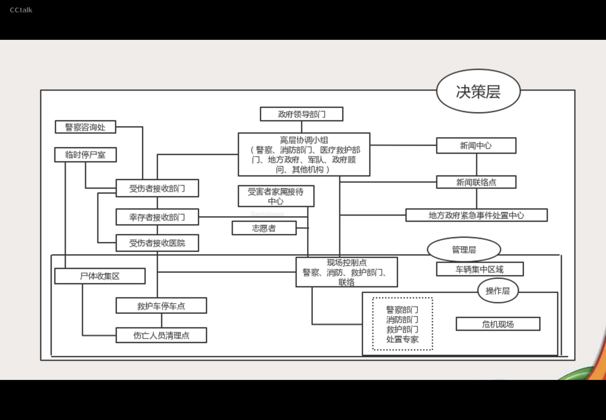

# [办理刑事案件能力](29%20办理刑事案件能力.md)
# [办理治安行政案件能力](28%20办理治安行政案件能力.md)
# 应急处突能力
## 突发事件的分类
### 自然灾害
- 主要包括水旱灾害，气象灾害，地震灾害，地质灾害，海洋灾害，生物灾害和森林草原火灾等
### 事故灾害
- 主要包括工矿商贸等企业的各类安全事故，交通运输事故，公共设施和设备事故，环境污染和生态破坏事件等
### 公共卫生事件
- 主要包括传染病疫情，群体性不明原因疾病，食品安全和职业危害，动物疫情，以及其他严重影响公众健康和生命安全的事件
### 社会安全事件
- 主要包括恐怖袭击事件，经济安全事件和涉外突发事件等
> [!note]
> 国家对突发事件实施分级预警制度，可以预警的突发事件，按照其性质、严重程度、可可控性和影响范围等因素，一般分为四级：
>  Ⅰ级（特别重大）——红色预警标识
>  Ⅱ级（重大）——橙色预警标识
>  Ⅲ级（较大）——黄色预警标识
>  IV级（一般）——蓝色预警标识
突发事件的领导职责
### 突发事件的领导职责
1. **县级人民政府**对本行政区域内突发事件的应对工作负责；涉及两个以上行政区域的，由有关行政区域**共同的上一级人民政府**负责，或者由各有关行政区域的上一级人民政府共同负责。
2. 突发事件发生后，**发生地县级人民政府**应当立即采取措施控制事态发展，组织开展应急救援和处置工作，并立即向上一级人民政府报告，必要时可以越级上报。
#### 群体性事件的领导职责
- 群体性治安事件的**现场处置工作**，由事件发生地的县（市）公安机关负责；跨地区发生的，由共同的上一级公安机关负责，也可以由上级公安机关指定的公安机关负责
### 快速反应原则
- 对于具体的预警措施，根据《突发事件应对法》的规定：
#### 三级四级
1. 发布三级、四级警报，宣布进入预警期后，县级以上地方各级人民政府应当根据即将发生的突发事件的特点和可能造成的危害，采取下列措施：
    1. 启动应急预案;
    2. 责令有关部门、专业机构、监测网点和负有特定职责的人员及时收集、报告有关信息，向社会公布反映突发事件信息的渠道，加强对突发事件发生、发展情况的监测、预报和预警工作；
    3. 组织有关部门和机构、专业技术人员、有关专家学者，随时对突发事件信息进行分析评估，预测发生突发事件可能性的大小、影响范国和强度以及可能发生的突发事件的级别；
    4. 定时向社会发布与公众有关的突发事件预测信息和分析评估结果，并对相关信息的报道工作进行管理；
    5. 及时按照有关规定向社会发布可能受到突发事件危害的警告，宣传避免、减轻危害的常识，公布咨询电话。
#### 一级二级
1. 发布一级、二级警报，宣布进入预警期后，县级以上地方各级人民政府除采取本法第四十四条规定的措施外，还应当针对即将发生的突发事件的特点和可能造成的危害，采取下列一项或者多项措施：
    1. 责令应急救援队伍、负有特定职责的人员进入待命状态，并动员后备人员做好参加应急救援和处置工作的准备；
    2. 调集应急救援所需物资、设备、工具，准备应急设施和避难场所，并确保其处于良好状态、随时可以投入正常使用；
    3. 加强对重点单位、重要部位和重要基础设施的安全保卫，维护社会治安秩序；
    4. 采取必要措施，确保交通、通信、供水、排水、供电、供气、供热等公共设施的安全和正常运行；
    5. 及时向社会发布有关采取特定措施避免或者减轻危害的建议、劝告;
    6. 转移、疏散或者撒离易受突发事件危書的人员井予以妥善交置，转移重要财产;
    7. 关闭或者限制使用易受突发事件危害的场所，控制或者限制容易导致危害扩大的公共场所的活动；
    8. 法律、法规、规章规定的其他必要的防范性、保护性措施。
> [!note]
> 此外，对即将发生或者已经发生的社会安全事件，县级以上地方各级人民政府及其有关主管部门应当按照规定向上一级人民政府及其有关主管部门报告，必要时可以越级上报。

### 警戒线设置
- 对应急现场，应从其核心现场开始，向外设置多层警戒，一般做法是设置两层以上，由内到外，由高密度向低密度布置警戒人员。
- 一般而言，分为内围警戒线（核心区） 和外围警戒线（处置区）
- 内围警戒线要圈定事故或事件的核心区域，根据现场的具体情况，划定事件发生和产生破坏影响的集中区域，在核心区域内一般只允许医疗救护人员、警察、消防人员、应急专家或专业的应急人员进入，井成立现场控制小组，组织开展各项控制和救助工作。
- 外围警戒线的划定以满足救援处置工作的需求为主要考虑因素，为保证安全，大量的应急救援工作是在内国警戒线之外开展的。因此，外国警戒线是处置工作顺利开展的必要空间，无关人员，包括媒体工作人员一般不应进入此区域。

### 应急处置
- 突发事件发生后，履行统一领导职责或者组织处置突发事件的**人民政府**应当针对其性质、特点和危害程度，**立即组织有关部门，调动应急救援队伍和社会力量，依照本章的规定和有关法律、法规、规章的规定采取应急处置措施**。
#### 处置措施
##### 自然灾害、事故灾难或者公共卫生事件
- **自然灾害、事故灾难或者公共卫生事件**发生后，履行统一领导职责的人民政府可以采取下列一项或者多项应急处置措施：
    1. 组织营救和救治受害人员，疏散、撤离并妥善安置受到威胁的人员以及采取其他救助措施；
    2. 迅速控制危险源，标明危险区域，封锁危险场所，划定警戒区，实行交通管制以及其他控制措施；
    3. 立即抢修被损坏的交通、通信、供水、排水、供电、供气、供热等公共设施，向受到危害的人员提供避难场所和生活必需品，实施医疗救护和卫生防疫以及其他保障措施；
    4. 禁止或者限制使用有关设备、设施，关闭或者限制使用有关场所，中止人员密集的活动或者可能导致危害扩大的生产经营活动以及采取其他保护措施；
    5. 启用本级人民政府设置的财政预备费和储备的应急救援物资，必要时调用其他急需物资、设备、设施、工具；
    6. 组织公民参加应急救援和处置工作，要求具有特定专长的人员提供服务；
    7. 保障食品、饮用水、燃料等基本生活必需品的供应；
    8. 依法从严惩处囤积居奇、哄拾物价、制假售假等扰乱市场秩序的行为，稳定市场价格，维护市场秩序；
    9. 依法从严惩处哄抢财物、干扰破坏应急处置工作等扰乱
    10. 社会秩序的行为，维护社会治安;
    11. 采取防止发生次生、行生事件的必要措施。
##### 社会安全事件
- 社会安全事件发生后，组织处置工作的人民政府应当立即组织有关部门并由公安机关针对事件的性质和特点，依照有关法律、行政法规和国家其他有关规定，采取下列一项或者多项应急处置措施：
    1. 强制隔离使用器械相互对抗或者以暴力行为参与冲突的当事人，妥善解决现场纠纷和争端，控制事态发展;
    2. 对特定区域内的建筑物、交通工具、设备、设施以及燃料、燃气、电力、水的供应进行控制；
    3. 封锁有关场所、道路，查验现场人员的身份证件，限制有关公共场所内的活动；
    4. 加强对易受冲击的核心机关和单位的警卫，在国家机关、军事机关、国家通讯社、广播电台、电视台、外国驻华使领馆等单位附近设置临时警戒线；
    5. 法律、行政法规和国务院规定的其他必要措施。
- 严重危害社会治安秩序的事件发生时，公安机关应当立即依法出动警力，根据现场情况依法采取相应的强制性措施，尽快使社会秩序恢复正常。

> [!《突发事件应对法》]
> 有关人民政府及其部门为应对突发事件，可以征用单位和个人的财产。被征用的财产在使用完毕或者突发事件应急处置工作结束后，应当及时返还。财产被征用或者征用后毁损、灭失的，应当给予**补偿**
#### 事后恢复与重建
1. 突发事件的威胁和危害得到控制或者消除后，履行统一领导职责或者组织处置突发事件的**人民政府**应当停止执行依照本法规定采取的应急处置措施，同时采取或者继续实施必要措施，防止发生自然灾害、事故灾难、公共卫生事件的次生、衍生事件或者重新引1发社会安全事件。
2. 突发事件应急处置工作结束后，履行统一领导职责的人民政府应当立即组织对突发事件造成的损失进行评估，组织受影响地区尽快恢复生产、生活、工作和社会秩序，制定恢复重建计划，并向上一级人民政府报告。 受突发事件影响地区的人民政府应当及时组织和协调**公安、 交通、 铁路、民航、邮电、建设等有关部门恢复社会治安秩序**，尽快修复被损坏的交通、通信、供水、排水、供电、供气、 供热等公共设施。
#### 群体性事件现场处置
##### 群体性事件的界定
- 是指由具有共同目标和利益的社会群体实施的，违反国家法律、法规、规章，扰乱公共秩序，危害公共安全，侵犯公民人身安全和财产安全，尚属于人民内部矛盾范畴的冲突行为。
##### 领导体制
- 群体性治安事件的现场处置工作，由事件发生地的县（市）公安机关负责；跨地区发生的，由共同的上一级公安机关负责，也可以由上级公安机关指定的公安机关负责
##### 群体性事件处置原则（《公安机关处置群体性事件规定》 第三条）
1. 预防为主。公安机关应加强情报信息工作，建立和完善维护社会稳定的预警工作机制，对影响稳定的问题和群体性事件苗头，做到早发现、早报告、早控制、早解决，把问题解决在初始阶段；
2. 统一领导。群体性事件发生后，公安机关应当在觉委、政府的统一领导下，既要依法维护社会秩序，平息事态，又要协助有关部门做好群众工作，努力化解矛盾。
3. 三慎原则：**慎用警力、慎用强制措施、慎用武器警械**。公安机关处置群体性事件，既要防止使用警力和强制措施不当而激化矛盾，又要防止贻误战机，使事态扩大。处置群体性事件一线民警禁止携带、使用致命性武器。
4. 教育疏导。公安机关处置群体性事件，应当讲究政策，讲究策略，讲究方法，对现场群众以**法制宣传、教育疏导**为主，引1号群众理性、合法地表达诉求，防止矛盾激化，防止事态扩大，防止发生流血冲突。
5. 依法果断处置。对有**打砸抢烧等暴力行为**，严重危害社会治安，如不及时果断处置将造成更为严重危害后果的群体性事件，公安机关应当依法果断采取措施，坚决予以制止，尽快平息事态
##### 群体性事件措施
###### 管制措施
- 公安机关处置群体性事件，可以根据现场情况，经现场指挥批淮，依法采取下列管制措施：
    1. 封闭现场和相关区域；
    2. 设置警戒带、隔离设施等，划定警戒区和新闻采访区，隔离围观人员;
    3. 实施区域性交通管制；
    4. 守护重点目标;
    5. 查验现场人员身份证件和随身携带的物品。
###### 强制措施
- 公安机关处置群体性事件，可以根据现场情况，经现场指挥批准，依法采取下列强制性措施：
    1. 发布命令或者通告，责令围观人员立即离开现场，责令聚众组织者立即解散人群，责令聚集的人员在限定时间内迅速疏散；
    2. 对超过限定时间仍滞留现场或者袭击人民警察、强行冲越警戒线的人员，经警告无效的，可以根据现场情况，依法使用警棍、盾牌、催泪弹、高压水枪、防暴枪等必要的驱逐性或者制服性警械强行驱散；使用警械前，现场民警应当以广播、举牌等方式明确告知聚集群众，并将告知方式以适当形式记录在案;使用警械处置群体性事件，应当以制止违法犯罪行为为限度，当违法犯罪行为得到制止时，应当立即停止使用；
    3. 对经强行驱散仍拒不离去的人员或者进行煽动的人员，应当选择有利时机将其强行带离现场或者予以拘留；
    4. 对冲击党政机关和重点要害单位、卧轨拦截列车、阻断交通干线、聚众滋事、械斗等情况以及发生打砸抢烧等严重违法犯罪行为的，应当采取果断措施立即制止，并选择有利时机将首要分子和骨千人员强行带离现场或者予以拘留；
    5. 对非法携带的武器、管制刀具、易燃易爆等危险物品和用于非法宣传、煽动的工具、标语、传单等物品，予以收缴，并处理有关责任人员。
##### 警力调动权限
1. 调动100人以下，县级公安机关主要负责人批准
2. 调动100-300人，地市级公安机关主要负责人批准
3. 调动300人以上，省级公安机关主要负责人批准，报公安部备案
4. 跨区域调动，共同的上级公安机关批准

> [!重点]
> - 现场处置群体性事件可根据需要部署一、二、三线警力。
> - **一线警力**主要担负现场秩序的维护和控制任务。根据指令，穿插隔离参与者，强制带离挑头闹事者，对超过时限仍滞留现场的人员，可以实施强行驱散。
> - **二线警力**担任外围警戒任务。主要负责设立警戒带，划定警戒区域，拦截清理围观者，封闭现场和相关地区，守护重点目标，查验现场人员证件，检查嫌疑人员携带的物品，检查并禁止未经批准进入现场录音、录像、拍照、采访等人员。要严密群体性事件现场管控，严防不法分子混入进行捣乱破坏。
> - **三线警力**为机动应急力量，主要是根据指令执行紧急救援、驱散人群、制服犯罪等特殊任务。

#### 警力使用情形
- 不得动用警力直接处置情形
    1. 集会、游行、示威发生在校园、单位内部，未发生行动、非法拘禁、打砸抢行为
    2. 聚众上访未发生堵门、堵路、拦截车辆、围殴国家机关工作人员
    3. 因征地拆迁、企业改制等与群众切身利益相关的群体性事件，聚众现场尚未危害交通秩序和治安秩序的
    4. 其他人民内部矛盾尚未激化，可化解的群体性事件
- 动用警力强行处置的情形：
    1. 未经许可或末按照许可进行集会、游行、示威；集会、游行、示威中出现严重扰乱社会秩序或危害公共安全的行为
    2. 聚众上访出现严重扰乱社会秩序或危害公共安全行为；
    3. 邪教等非法组织的较大规模聚集活动；
    4. 聚众围堵、冲击党政机关等要害部门或单位;
    5. 其他严重扰乱社会秩序或危害公共安全的群体性事件。

# 群众工作能力
## 宣传教育
- 是指公安机关及人民警察根据**群众工作**的目标，运用不同的表现方式**传播相关信息**，以影响群众观念、引导其行为的社会活动。宣传教育群众，是公安群众工作的基础性工作，也是公安群众工作最基本的工作方法
### 原则
#### 党性原则
#### 真实原则
#### 保密原则
1. 有关公安机关工作的重大部署和行动方案一般不得公开宣传
2. 有关公安工作方面属于保密范围的数据不得对外发表
3. 性质恶劣的案件未经上级公安机关批准不得报道
4. 宣传中不得引用公安工作的秘密内容及专门概念
5. 对于涉外、涉军、隐私等案件及未侦查案件未经批准不得对外公布等
##### 警务工作秘密
1. 打击违法犯罪活动的**具体工作部署、行动方案、情况报告**及其他有关情况；
2. 隐蔽工作单位的代号、地址和电话号码
3. 警务活动中使用的**密语、代号和通信联络方法**
4. 治安耳目、监所内耳目的布建、使用及档案管理情况；
5. **正在侦查**的**一般刑事案件**的具体工作方案、案情、工作进展情况，**将对**犯罪嫌疑人采取刑事强制措施的情况;
6. 公安机关侦查手段，特别是使用**特情和技术侦查措施**的情况；
7. 详细的**作案手段、凶杀场面和涉及色情内容**的案件过程和细节；
8. 公安机关内部计算机网络使用和安全防范措施情况；
9. 武器警械装备标准、配备情況；
10. 未公布的民警违法违纪的**统计数宇和情况**
11. 有关公安工作方面属于保密的数据；
12. 调查掌握的**社情动态及综合情况**等。
#### 有效原则
## 沟通协调
- 步骤
    - 确定沟通协调的目的
    - 调查走访摸清情况
    - 掌握沟通技能进行有效沟通
    - 及时反馈，查看沟通协调效果，以便及时调整沟通策略
- 核实社区的**人、地、事、物、组织五大治安要素**
## 组织动员
## 服务群众
### 窗口单位
- 是指各级公安机关值班室、接待室、交警队、刑警队、派出所、车管所、出入境管理办证室、边防检查站执勤现场、信访办、办证中心以及其他面向社会、接待和服务群众的单位
#### 活动事项变更
- 对经安全许可的大型群众性活动，承办者**不得擅自变更活动的时间、地点、内容或者扩大大型群众性活动的举办规模**。承办者变更大型群众性**活动时间**的，应当在原定举办活动时间之前向做出许可决定的公安机关**申清变更**，经公安机关同意方可变更。承办者**变更大型群众性活动地点、内容以及扩大大型群众性活动举办规模**的，应当依照本条例的规定**重新申请安全许可**。
## 治安风险识别与应对
### 概念
- 在特定的时问间、空间所进行的,由众多人员参加的,具有一定影响的有益的活动。如演唱会、体育比赛、人才招聘会等。
### 公安机关安全管理职责
1. 事前审批与检查。预计参加人数1000~5000人,活动所在地县公安局实施安全许可;5000人以上的,活动所在地设区的市公安局或直辖市公安局实施安全许可;跨省、自治区、直辖市举办的,由公安部批准；
2. 事中监督和调控；
3. 事后总结,建立大型活动不良安全信息记录制度并向社会公布
### 活动前
1. 举办场所场地设施是否符合安全规定；
2. 通道及进出口是否畅通；
3. 电器设备是否符合用电标准，是否有备用电源；
4. 消防器材是否配备齐全;
5. 检查场地安全(有无危险物品、有无障碍物）。
### 活动中
1. 维护周边交通秩序,事先设计人员、 车辆进出路线,与交管部门协商增开公共交通运量和时间,提前编织出行指南井宣传,还可以交通管制,但应公告；
2. 合理安排停车场,可在活动场所周边设置临时停车场并指挥停放,设置时不要太过集中；
3. 入口处协助工作人员维护入场秩序，有权对入场人员进行人身检查和物品检查；
4. 公开与秘密警力结合,发现安全隐患,立即排解
### 活动后
- 指挥、控制出散场秩序
### 处置措施
1. 出现**严重安全隐惠时，责令大型活动主办方停止活动**。如现场人员严重超载：活动中发生安全事故的：有发生安全事故危险或可能危害公共安全的其他紧急情形的：主办方自变更活动场所或内容的；主办方、场地提供者不落实安全责任的；现场秩序混乱,影响活动正常进行的。
2. 将正在实施违法犯罪行为的人强行带离现场：
3. 对大型活动现场经公安机关命令解散而拒不离去的群体,可强行驱散。
# 公安情报信息工作能力
- 情报信息时公安信息的一个重要组成部分，是关于治安状况、治安环境以及治安防控等情况的表征和反映
- 情报工作主要包括收集、分析研判和使用三个方面
## 情报与信息
- 情报与信息是情报学的两个最基本概念，情报是为一定目的服务，由载体传递，能被人感知、接受和利用的一种信息，具有知识性、传递性和价值性。
- 信息是物质的一种普遍属性，泛指人类社会传播的一切内容。其中二者的关系表现为：信息是情报的基础，情报是对信息进行加工、分析后得到的有价值的结果，是经过提炼的信息。
> [!note]
> 事实->数据->信息->知识->情报

## 情报信息的分类
### 表现形态
#### 静态情报
- 人口、地理、交通等基础情报
#### 动态情报
- 犯罪活动发展变化轨迹，个人及团伙的动机、意图、相互关系等情报
#### 预测情报
- 对公共安全风险、犯罪形势、社会稳定因素进行研究、评估形成的情报
### 情报内容
#### 敌情类情报信息
- 包括敌对分子、境内外敌对势力、民族分裂势力、宗教极端势力、恐怖组织等有关危害国家安全的情报信息
#### 维稳类情报信息
- 包括大规模游行、请愿、上访、罢市等集体活动、恶性突发事件和恶性刑事案件等影响社会稳定的事件和因素的情报信息
#### 舆情类情报信息
- 包括重大会议、方针以及战略部署等信息；宗教、思想、文化等社会民意；民众在新闻媒介中对社会重大事件的反映等信息
## 情报信息受理的范围
1. 社会各界对国内外重大事件、热点问题的反应（舆情）
2. 可能引发群体性治安事件的线索及苗头（维稳）
3. 敌对组织、邪教、会道门以及其他非法组织活动的情况（敌情）
4. 预谋实施爆炸、杀人、抢劫、盗窃等犯罪活动的情况（维稳）
5. 因各类民事纠纷可能铤而走险、制造事端的危险人员情况（维稳）
6. 其他可能影响社会政治稳定和社会治安的情报信息
## 情报收集的方式
1. 在重点场所、要害部位物建治安耳目、情报信息员
2. 依靠基层组织、治安积极分子等收集情报信息
3. 通过人口调查、阵地控制等方式听取群众意见
4. 通过接触重点人员了解掌握情报信息
> [!⚠️注意]
> 技术侦查措施收集。《中华人民共和国反恐怖主义法》第45条规定：因反恐怖主义情报信息工作的需要，经过严格的批准手续，也可以采取技术侦查措施

## 情报收集后的处理
- 对获取的线索、人员、行动类情报信息应当统一归口、及时上报，并注意日常积累分析，对涉及其他地方的紧急情报信息，应当及时通报相关地方。情报信息的报送应当及时、准确、客观，不得迟报、漏报、瞒报和谎报
> [!note]
> 《中华人民共和国反恐怖主义法》规定：国家反恐怖主义工作领导机构建立国家反恐怖主义情报中心，实行跨部门、跨地区情报信息工作机制，统筹反恐怖主义情报信息工作。有关部门应当加强反恐怖主义情报信息搜集工作，对搜集的有关**线索、人员、行动类情报信息**，应当依照规定及时统一归口报送国家反恐怖主义情报中心。地方反恐怖主义工作领导机构应当建立跨部门情报信息工作机制，组织开展反恐怖主义情 报信息工作，对重要的情报信息，应当及时向上级反恐怖主义工作领导机构报告，对涉及其他地方的紧急情报信息，应当及时通报相关地方。反恐怖主义工作领导机构、有关部门和单位、个人应当对履行反恐怖主义工作职责、义务过程中知悉的国家秘密、商业秘密和个人隐私予以保密。违反规定泄露国家秘密、商业秘密和个人隐私的，依法追究法律责任。**依照技术侦察获取的材料，只能用于反恐怖主义应对处置和对恐怖活动犯罪、极端主义犯罪的侦查、起诉和审判，不得用于其他用途**。

## 情报信息分析和应用
### 数据分析题型

### 社交网络分析题型
### 电话记录分析题型
### 聊天记录分析题型
### 活动轨迹分析题型
### 矩阵分析题型
# 公安勤务能力
## 巡逻
- 巡逻好似公安机关及其人民警察的一种基本的勤务，是指人民警察为了防控洁面秩序、解决群众纠纷，为公众提供帮助、服务和制止犯罪活动，处置紧急事件等巡查、警戒的勤务活动
- 作用
    1. 对社会面违法犯罪活动进行时空防控
    2. 迅速赶赴警情现场
    3. 维护公共安全和社会秩序
    4. 提供社会服务，为公众提供帮助
### 以交通方式的角度划分
#### 步巡
- 不受时空影响、不受气候条件影响，机动车巡逻不到的小街、小巷适宜安排步巡
- 优点：可以随时出现，及时接受群众求助，易于拉近警民关系，增强群众安全感，及时掌握社情民意
- 缺点：对警察体力要求高，使巡警易疲惫从而警务效能下降；巡逻速度慢，不易追踪犯罪嫌疑人；单个巡逻活动范围小，视野窄；反应速度慢、机动性差，应对机动化违法犯罪时力不从心
#### 自动车巡逻
- 有着步巡的优点，方便联系群众，速度快于步巡，较快反应，降低警察疲惫、提高警务效能，经济便携
- 缺点：应对机动化违法行为力不从心
#### 机动车巡逻
- 包括汽车和摩托车巡逻。
- 优点：车巡速度快，机动性高，能够及时快速反应，及时追捕违法犯罪嫌疑人；车巡范围大，节省人力，警务效能高
- 缺点：不方便出入小巷巡逻，与群众有隔阂感，不易拉近与公众关系，不易为公众提供服务，而且不经济、耗资大
#### 空中巡逻
- 直升机巡逻
- 空中巡逻主要执行空中指挥交通，追踪利用车辆作为交通工具的严重犯罪分子，执行紧急服务、救助危难，侦查沙漠、丘陵、湖泊、森林等宽阔地带
- 特点：居高临下，视野开阔，有效指挥地面、水面巡查工作，追捕逃犯，搜寻失踪人员等，是其他巡逻方式完全不能比拟的
- 缺点：经费投入大，专业技术高，并且受气候地形条件限制
#### 骑马巡逻
- 使用特定区域，如内蒙古、新疆、西藏等地广人稀的草原、丘陵等地方，骑马是日常交通方式，也成为巡逻的方式；城市间的骑马巡逻一般不具有巡逻的实质性
#### 舟巡
- 水上巡逻，适用船只、汽艇等水上交通工具对水上进行巡逻，包括江河、湖泊、沿海水域，维护水上治安秩序
### 以巡逻路线划分
- 分为直线巡逻、环线巡逻、直线加环线交叉巡逻和网格化巡逻，巡逻路线是根据某区域的治安状况进行划分的。网格化巡逻对社会面的防控最为严密，但也需要最多警力
### 以着装划分
- 着装巡逻和便衣巡逻
### 巡逻区域划分
- 考虑因素
    1. 辖区面积
    2. 辖区地域特征
    3. 辖区气候状况
    4. 辖区治安、交通状况
    5. 接处警的规定时间等因素
## 盘查和继续盘问
### 盘查
- 是指公安机关人民警察在执行勤务过程中，为维护公共安全，预防、发现、控制违法犯罪活动而依法采取的盘问、检查等行为。包括盘问、检查和继续盘问
- 规范：
    - 民警执行盘查任务时，应当着制式服装；未着制式服装的，应当出示人民警察证；应当向被盘查人敬礼并告知：“我是xxx（单位）民警，现依法对你进行检查，请你配合。”经盘查排除违法犯罪嫌疑的，民警应当向被盘查人敬礼，并说“谢谢你的合作”，礼貌让其离去

- 警戒时要注意全盘警戒，警力可以的情况下要坚持各个关键部位的警戒，比如门口，出入口、窗户、以及盘问人员的周边
- 盘查多名可疑人员时，民警应当责令所有被盘查人背对开阔场地，并在实施控制后后，分别进行盘查。当警力不足以有效控制被盘查人时，应当维持控制状态，立即报告，请求支援

> [!查验身份时，应当先查验身份证件并遵守下列规定]
> 1. 查验证件防伪暗记和标识，判定证件的真伪
> 2. 查验证件内容，进行人、证对照
> 3. 注意被盘查人的反应，视具体情况让持证人自述证件内容，边查边问
> 4. 通过身份识别仪器或者公安信息系统进行核对

> [!人身检查]
> 对经过盘问，确认有违法犯罪行为或者嫌疑不能排除的，应当先对被盘查人依法进行人身检查，并进一步检查其携带物品。对可疑人员进行人身检查时，应当遵守下列规定：
> 1. 有效控制被检查的嫌疑对象，在警戒人员的掩护下对其进行检查，防止自身受到攻击和伤害；
> 2. 对女性进行人身检查，应当由女性工作人员进行，可能危及检查民警人身安全或者直接危害公共安全的除外；
> 3. 对拒绝接受检查的，民警可依法将其带回公安机关继续盘问；
> 4. 对可能携带凶器、武器或者爆炸物品的违法犯罪嫌疑人检查时，应当先检查其有无凶器、武器和爆炸物品，如有，则应当当场予以扣押，必要时，可以先依法使用约束性警械，然后进行检查；
> 5. 责令被检查人伸开双臂高举过头，面向墙、车等，扶墙或者扶车站立，双脚分开尽量后移，民警站于其身后并将一只脚置于其双脚中间，迅速从被检查人的双手开始向 下对衣领及身体各部位进行检查，特别注意腋下、腰部、裆部及双腿内侧等可能藏匿凶器或者武器的部位；
> 6. 当盘查对象对异常举动时，民警应当及时发出警告，命令其停止动作并做好自身防范，可以依法视情使用警棍、催泪喷雾器及武器等予以制止。

> [!物品检查]
> 对可疑物品进行检查时，应当遵守下列规定：
> 1. 责令被检查人将物品放在适当位署，不得让其自行翻拿
> 2. 由一名民警负责检查物品，其他民警负责监控被检查人；
> 3. 开启箱包时应当先仔细观察，注意避免接触有毒、爆炸、腐蚀、放射等危险物品；
> 4. 按照自上而下顺序拿取物品，不得掏底取物或者将物品直接倒出;
> 5. 对有声、有味的物品，应当谨慎拿取；
> 6. 发现毒害性、爆炸性、腐蚀性、放射性或者传染病病原体等危险物质时，应当立即组织疏散现场人员，设置隔离带，封锁现场，及时报告，由专业人员进行排除
> 7. 对于需没收或者扣押的各类违禁物品，应当会同在场见证人和被扣押物品持有人查点清楚，当场开列清单，及时上交有关部门；
> 8. 避免损坏或者遗失财物。

> [!车辆检查]
> 对可疑车辆进行检查时，应当遵守 下列规定：
> 1. 对行进中的车辆进行拦截检查时，应当手持停车标志牌或者放置停车标志，在被检查车辆前方向其作出明确的停车示意；
>     1. 责令驾驶员将车辆熄火，拉紧手制动，将双手放在方向盘上，确认安全后拉开车门责令其下车，必要时应当暂时收存车钥匙；（可以要求将车钥匙放于车顶）
> 2. 对人员进行检查并予以控制
> 3. 查验身份证、驾驶证、行驶证和车辆牌照，条件允许情况下，通过公安信息查询系统进行查询比对；
> 4. 观察车辆外观、锁具和内部装置；
> 5. 检查车载货物和车内物品;
> 6. 如驾驶员拒检逃逸，应当立即报告，请求部署堵截、追缉。

> [!设卡检查]
> 公安机关执行设卡检查任务时，应当遵守下列规定：
> 1. 制定方案，周密部署，方案应当包括任务目标、卡点布局、指挥关系、协作机制和警力、装备、通信、后勤保障措施，以及处置突发情况的应对措施等内容；
> 2. 设置卡点应当选择视野开阔、便于拦截检查和展开警力的地点，并尽量避开人群、居民稠密区、密林区、易燃易爆和剧毒化学物品仓库等复杂地段和场所；
> 3. 检查卡点应当根据任务需要配置警力，每个卡点一般不得少于4人，民警之间应当明确拦截、警戒和盘查等任务分工；
> 4. 执行重要设卡堵截任务时，公安机关应当在卡点前方设置阳车路障，并在前方适当距离内设置隐蔽观察哨位，以便提前发现目标，及时通知卡点准备拦截；
> 5. 民警拦截车辆时，应当在卡点前方设置明显停车示意标志或者由执行拦截任务的民警手持停车示意牌示意停车，其他民警负责警戒和盘查；被检查人如驾车闯卡，民警应当立即采取措施迫其停车，或者追击、拦截，并及时向上级报告，请求支援；
> 6. 对被拦截车辆进行检查时，执行盘查任务的民警应当从**车辆的驾驶员一侧**接近车辆，迅速控制驾驶员和车内其他人员；执行警戒任务的民警应当占据有利位置，从各个角度密切监视车内人员，车上人员应当逐一下车接受盘查。

#### 拒检逃逸
- 驾驶员拒检逃逸的，应当立即报告本单位有关负责人，请求部署拦截；除驾车逃跑后可能对公共安全和他人生命安全有严重威胁以外，民警不得驾车追缉，可采取通知前方执勤民警堵截，或者记下车号，事后追查等方式处理
### 继续盘问
- 是指公安机关的人民警察为了维护社会治安秩序，对违法犯罪嫌疑人的人员当场盘问、检查后，发现具有法定情形而将其带至公安机关继续进行盘问的措施

#### 不得适用继续盘问的人员
1. 有违反治安管理或者犯罪嫌疑，**但未经当场盘问、检查的**；
2. 经过当场盘问、检查，已经排除违反治安管理和犯罪嫌疑的；
3. 涉嫌违反治安管理行为的法定最高处罚为警告、罚款或者**其他非限制人身自由的行政处罚的**；
4. 从其住处、工作地点抓获以及其他**应当依法直接适用传唤或者拘传的**；
5. 已经到公安机关**投案自首**的；
6. 明知其所涉案件**已经作为治安案件受理或者已经立为刑事案件的**；
7. 不属于公安机关管辖的案件或者事件当事人的；
8. 患有**精神病、 急性传染病或者其他严重疾病**的;
9. 其他不符合本规定第八条所列条件的。
#### 继续盘问时限

#### 审批流程

- 被盘问人的家属为**老年人、残疾人、精神病人、不满16周岁的未成年人或者其他没有独立生活能力的人**，因公安机关实施继续盘问而使被盘问人的家属无人照顾的，公安机关**应当**通知其亲友予以照顾或者采取其他适当办法妥善安排，并将安排情况及时告知被盘问人
> [!note]
> 在继续盘问间隙期间，应当将被盘问人送入候问室;未设置候问室的，应当由人民警察在讯问室、办公室看管,或者送入就近公安派出所的候问室。
> 禁止将被盘问人送入看守所、拘役所、拘留所、强制戒毒所、收容教育所或者其他监管场所关押，以及将不同性别的被盘问人送入同一个候问室

## 接警和处警
- 1986年1月10日，广州市公安局建立了我国第一个110报警平台
- 2003年我国公安部正式制定110接处警工作规则
- 设置部门：城市和县（旗）公安局指挥中心应当设立110报警服务平台，负责全天24小时受理公众紧急电话报警、求助和对公安机关及其人民警察现时发生的违法违纪或者失职行为的投诉
### 领导体制
- **公安机关情报指挥部门**负责组织、指导110接处警工作，在警情处置中行使直接指挥、指定处警、装备调用、数据调取、检查督导等职能。
- **公安部情报指挥中心**负责对全国公安机关110接处警工作进行**业务指导、协调和监督检查**。
- **省、自治区、直辖市公安厅、局和新疆生产建设兵团公安局情报指挥部门**负责对本行政区划内的公安机关110接处警工作进行**业务指导、协调和监督检查**。
### 总原则
- 一级处警、分类处警、就近处警
#### 具体应用
- 属地管辖原则：指令案（事）件所在地或报警人、求助人、投诉人所在地公安机关出警
- 就近管辖原则：指令距离案（事）件所在地最近的单位、民警出警
- 业务管辖原则：指令公安机关主管部门出警
- 先期处置原则：对管辖不明的案（事）件，先指定处警人员先行处理，管辖权明确后再移交有管辖权的公安机关进行处理
### 报警的受理
- 一级接警，即统一由城市或者县（旗）公安局110报警服务台接警
- 110报警服务台工作人员应当掌握和使用普通话，在受理报警、求助、投诉时应当做到：
    1. 警容严整，行为规范，态度热情
    2. 接听电话时主动说：“您好，xx（市、县）110，xx号接警员”
    3. 向当事人问明案（事）件的主要情况及当事人的基本情况
    4. 按照统一的表格认真登记、存储，做好接报、指挥、处警工作记录，并立卷备查
- 受理范围：110报警服务台受理**报警、求助、投诉**
#### 110报警服务台受理报警的范围：
1. 刑事类警情
2. 治安类警情
3. 道路交通类警情
4. 危及人身、财产安全或者社会治安秩序的群体性事件
5. 治安灾害事故类警情
6. 其他需要公安机关处置的与违法犯罪有关的报警
#### 110报警服务台受理求助的范围
1. 发生溺水、坠楼、自杀等危及人身安全状态，以及公众遇到其他危难，处于孤立无援状况，需要公安机关紧急救助的
2. 发现老年人、儿童以及智力障碍人员、精神障碍患者等行为能力、辨别能力差的人员走失，需要公安机关在一定范围内紧急帮助查找的
3. 涉及水、电、油、气、热等公共设施出现险情，危及公共安全、人身或者财产安全，需要公安机关先期紧急处置的
4. 发生地震、洪涝、泥石流等自然灾害险情，危及公共安全、人身或财产安全和生产生活秩序，需要公安机关参与紧急处置的
5. 其他需要公安机关处置的紧急求助事项
> [!note]
> - 接到溺水、坠楼、自杀等危及人身安全的紧急求助，110报警服务台应当迅速问明现场情况，**立即调派警力携带必要的救援器材赶到现场**，开展紧急救助、维持秩序等工作，视情通报应急救援、医疗急救等部门以及救援、谈判等方面社会力量到场开展处置。专门力量到场的，现场处警人员应当积极配合其救援
> - 接到老年人、儿童以及智力障碍人员、精神障碍患者等行为能力、辦别能力差人员走失的紧急求助，对于走失地点、情节、原因等比较明确的，110报警服务台应当及时指令街面警力、辖区派出所等在一定范国内帮助查找，并视情发动社会力量参与寻找;对走失时间较长、去向难以判明，无法在一定范国内查找的，应当将其体貌特征以及公安机关工作情况记录备查，**并指令走失地或者走失人员居住地派出所会同有关警种、部门，按照相关规定调查处理；对儿童走失、已满14周岁未满18周岁的妇女失踪，以及走失人员疑似被侵害的，应当及时移交刑侦部门办理**。
> - 接到水、电、油、气、热等公共设施出现险情，危及公共安全、人身或者财产安全的紧急求助，110报警服务台**应当迅速通报相关主管部门和应急联动单位派员到场开展专业处置**，同时调派警力到场开展先期处置，协助有关部门做好抢救受伤人员、疏散被困群众、维持现场秩序、排除险情等工作。
> - 接到自然灾害险情，危及公共安全、人身或者财产安全和生产生活秩序的紧急求助，110报警服务台应当迅速通报应急救援相关部门到场处置，并根据灾書的种类、程度迅速派警处置。
#### 110报警服务台受理投诉的范围
- 110报警服务台受理投诉的范围：公安机关及其人民警察正在发生的违反《中华人民共和国人民警察法》《公安机关人民警察纪律条令》等法律、法规和人民警察纪律规定，违法行使职权，不履行法定职责，不遵守各项执法、服务、组织、管理制度和违背职业道德的行为。
> [!note]
> - 110报警服务台对投诉应当视情采取相应措施，进行处理。
> - 10报警服务台接到投诉时，应当询问被投诉对象的基本情况、投诉的具体内容和投诉人基本情况、联系方式等。对投诉内容及投诉人情况，应当严格保密。
> - 对涉及本级公安机关及其人民警察违纪违法或者失职行为的投诉，110报警服务台应当通知**警务督察部门**进行现场调查处理，并视情指令就近警力到场先期处置。
> - 对与本级公安机关无束属关系的人民警察违纪违法或者失职行为的投诉，应当通知警务督察部门进行现场处置后按照规定移交，并视情**指令就近警力先期处置**。
> - 具体承办投诉的部门和单位，应当依照有关规定客观公正地进行调查处理，做到事实清楚、证据确凿、定性准确、处理适当、手续完备、程序合规。投诉办理情况应当及时向110报警服务台反馈，并按照规定向投诉人反馈，投诉人姓名、联系方式不实致使无法反馈的除外。
> - 对经查实的恶意投诉，应当依法追究相关人员责任，并为被恶意投诉人员澄清事实，消除影响，恢复名誉。
### 接处警程序
- 接到紧急报警、求助和投诉后，110接处警工作一般按照接受警情、判明管辖、下达指令、出警处警、情况反馈的程序开展，必要时边接警边先期派警。
    1. 接受警情。110报警服务台应当迅速询问、如实记录报警事项以及当事人相关情况。
    2. 判明管辖。110报警服务台应当根据警情发生地点、性质等基本要素，按照“就近、属地、业务”的原则，迅速确定处警单位或者处警人员
    3. 下达指令。110报警服务台确定处警单位或者处警人员后，应当及时下达清晰、明确的处警指令。
    4. 出警处警。处警人员应当按照指令及时出警，到达现场后依法妥善处置警情。
    5. 情况反馈。处警人员在到达现场、现场出现重大情况以及现场处置结束等环节，应当及时将处警情况向110报警服务台反馈
- 110报警服务台接到非紧急报警后，应当问明情况、做好记录并指令有关警种、部门或者基层单位及时开展处費工作。处警单位或者处警人员应当向110报警服务台及时反馈处置情况。
- 110报警服务台应当跟踪了解重大敏感警情处置工作进展，实时向处警民警推送警情背景、现场情况等信息，并根据警情性质及时向处警民警提供现场执法处置指引，为警情处置工作提供有力支撑。
- 接到现场处警人员不足以制止或者控制局面的报告后，应当迅速调集、指挥有关警种、部门或者基层单位赶赴现场增援。
### 报警类警情处置
- 接到报警类警情范国的报警后，110报警服务台应当迅速问明基本情况，根据警情性质、事态规模、紧急程度等，按照就近处警、分级分类处警原则及时派警处置。
    1. 接到正在发生的违法犯罪行为报警时，110报警服务台应当立即指令相关警种、部门或者基层单位迅速开展制止违法犯罪行为、控制抓捕嫌疑人、调查取证、布控查缉等工作。
    2. 接到违法犯罪线索举报时，110报警服务台应当做好记录并及时指令相关警种、部门或者基层单位开展处置工作。
    3. 接到**电信网络诈骗**等侵犯群众财产权益、需要紧急处置的报警时，110报警服务台应当立即会同相关警种、部门或者转至反诈中心(96110)，采取**等快速处置措施。
    4. 接到交通事故报警时，110报警服务台应当立即指令交通警察前往现场处置，并视情调派就近警力或者辖区派出所警力，通知消防救援、医疗急救等专业力量参与处置。涉及肇事逃逸的，应当按照规定组织实施堵截、布控、协查等工作。
        - 对轻微交通事故，可以根据道路交通事故处理相关规定，视情来用简易程序处理。
        - 具备条件的，**引导当事人通过互联网在线自行协商处理**。
    5. 接到危及人身、财产安全或者社会治安秩序的群体性事件报警时，110报警服务台应当立即报告公安机关负责人，通报业务主管部门，按照工作预案，及时派警赶赴现场维持秩序并协助有关部门做好疏导、化解矛盾工作，尽快平息事态。
    6. 按到治安灾害事故报警时，110报警服务台应当及时通报应急管理、消防救援等部门 机构，并迅速派警赶赴现场开展疏散人员、维持秩序、协助救援等工作。发现犯罪嫌疑的，应当同时指令刑侦等部门到场处置。
    7. 接到重大案（事） 件报警时，110报警服务台应当在按照工作预案派警先期处置的同时，立即报告公安机关负责人，视情启动应急处置机制，实行统一指挥、联合处置。
    8. 对需要跨区域布控查缉的重大警情，情报指挥部门在指挥调度本地警力处置的同时，应当请求有关地区公安机关协查处置，并视情报告上级公安机关。
        - 有关地区公安机关接到协查请求或者上级公安机关指令后，应当迅速落实查缉措施，并向警情发生地公安机关通报工作进展情况。
        - 处警民警应当按照规定着装，携带人民警察证和相关法律文书，配带对讲机、执法记录仪等单警装备和必要的警械、武器、防护装备。
#### 处警人员遇到下列突发情形，应当迅速采取措施，妥善控制现场事态
1. 对正在发生的违法犯罪行为，采取必要处置措施立即制止。制服或者有效约束违法犯罪嫌疑人后，对其人身以及携带的物品进行安全检查，排除危险。
2. 现场发现人员受伤需要救治的，立即通报医疗急救部门赶赴现场实施救治。违法犯罪嫌疑人被救治时，对其严格看管
3. 处置有爆炸、放射性、毒害、危险品泄漏等危及公共安全、人身安全的警情时，立即疏散周围人员，采取设置警戒区域等防护措施，并向110报警服务台报告，请求调集专业力量前往处理。涉及危险品移交的，由专业人员或者在专业人员指导下进行。
4. 对现场聚集围观、影响正常治安秩序的人员，及时劝离、疏散。必要时，设置警戒区域，依法采取交通管制、现场管制等措施。
    - 现场得到控制后，处警人员应当对现场采取必要的保护措施，依法开展调查取证工作。
    - 现场处置完毕后，需要进一步调查处理的，处警人员应当将有关人员和证据材料带回公安机关处理；需要移交的警情，按照有关规定向有管辖权的单位移交。

> [!注意]
> 大型群众性活动 排版有问题

