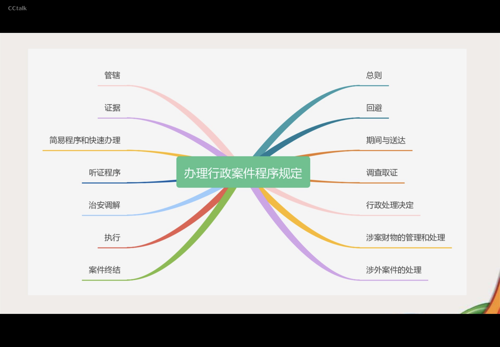

# 总则
## 办理行政案件的基本原则：
1. 办理行政案件应当以事实为依据，以法律为准绳;
2. 办理行政案件应当遵循**合法、公正、公开（7个工作日内，简易程序可以不公开）、及时**的原则，尊重和保障人权，保护公民的人格尊严
    - 行政许可、行政处罚的执法决定信息要在作出之日其7个工作日内公开，但法律、行政法规另有规定的除外。《公安机关执法公开规定》 规定，适用简易程序作出的行政处罚决定生效法律文书可以不向社会公开。
3. 办理行政案件应当坚持教育与处罚相结合的原则，教育公民、法人和其他组织自觉守法。
4. 办理未成年人的行政案件，应当根据未成年人的身心特点，保障其合法权益。
5. 办理行政案件，在少数民族聚居或者多民族共同居佳的地区，应当使用当地通用的语言进行询问。对不通晓当地通用语言文字的当事人，应当为他们提供翻译。
### 法律文书有下列情形之一的，不得向社会公开：
- 一是案件事实涉及国家秘密或者警务工作秘密的；
- 二是被行政处罚人、行政复议申请人是未成年人的；
- 三是经本机关负责人批准不予公开的其他情形。
- 向社会公开法律文书，应当对文书中载明的自然姓名作隐名处理,保留姓氏，名字以 “某” 替代。

# 管辖
1. 行政案件由违法行为地的公安机关管辖（原则规定）；
2. 由违法行为人居住地公安机关管辖更为适宜的，可以由违法行为人居住地公安机关管辖，但是涉及**卖淫、嫖娼、赌博、毒品**的案件除外。
3. 几个公安机关都有权管辖的行政案件，由最初受理的公安机关管辖。必要时，可以由主要违法行为地公安机关管辖。

> [!Tip]
> 违法行为地包括违法行为发生地和违法结果发生地。
> 违法行为发生地，包括违法行为的实施地以及开始地、途经地、结束地等与违法行为有关的地点;违法行为有连续、持续或者继续状态的，违法行为连续、 持续或者继续实施的地方都属于违法行为发生地。
> 违法结果发生地，包括违法对象被侵害地、违法所得的实际取得地、藏匿地、转移地、使用地、销售地。
> 居住地包括户籍所在地、经常居住地。经常居住地是指公民离开户籍所在地最后连续居住一年以上的地方，但在医院住院就医的除外。
> 
> 违法行为属于 “状态犯”的，则状态持续的地方也属于违法行为发生地。例如，吸食、注射毒品行为应当属于 “状态犯’，发现地公安机关就可以按照违法行为发生地原则管辖。

## 主要违法行为地：
1. 一人在不同地区有同一违法行为，其中主要违法行为地或者实施次数最多的地区；
2. 一人在不同地区有不同的违法行为，其中最严重的违法行为地;
3. 共同违法案件中，主要违法行为人实施违法行为的地区。
## 特殊情况管辖
1. 网络违法：针对或者利用网络实施的违法行为，用于实施违法行为的网站服务器所在地、网络接入地以及网站建立者或者管理者所在地，被侵書的网络及其运营者所在地，违法过程中违法行为人、被侵害人使用的网络及其运营者所在地，被侵害人被侵書时所在地，以及被侵書人财产遭受损失地公安机关可以管辖。(**沾边即能管**)
2. 行驶中的客车违法：行驶中的客车上发生的行政案件，由案发后客车**最初停靠地**公安机关管辖；必要时，始发地、途经地、到达地公安机关也可以管辖。
## 境外赌愽管辖
- 通过计算机网络、电话、手机短信等方式参与境外赌场赌博活动，由**违法行为人所在地公安机关**管辖。若中国公民赴境外赌场赌博，赌博输赢结算地在国内的，由**结算地公安机关**管辖。
## 管辖争议
- 对管辖权发生争议的，报请**共同的上级公安机关**指定管辖。对于重大、复杂的案件，上级公安机关可以直接办理或者指定管辖。上级公安机关直接办理或者指定管辖的，应当书面通知被指定管辖的公安机关和其他有关的公安机关。 原受理案件的公安机关自收到上级公安机关书面通知之日起不再行使管辖权，并立即将案卷材料移送被指定管辖的公安机关或者办理的上级公安机关，及时书面通知当事人。
## 铁、交、民、林、海行政案件管辖分工
- 铁路公安机关管辖**列车上，火车站工作区域内**，铁路系统的**机关、厂．段、所、队等**单位内发生的行政案件，以及在铁路线上放置障碍物或者损毁、移动铁路设施等可能影响铁路运输安全、盗窃铁路设施的行政案件。对**倒卖、伪造、变造火车票**案件，由**最初受理的铁路或者地方公安机关**管辖。必要时，可以移送主要违法行为发生地的铁路或者地方公安机关管辖。
- 交通公安机关管辖港航管理机构管理的轮船上、港口、码头工作区域内和港航系统的机关、厂、所、队等单位内发生的行政案件。
- 民航公安机关管辖民航管理机构管理的机场工作区域以及民航系统的机关、厂、所、队等单位内和民航飞机上发生的行政案件。
- 国有林区的森林公安机关管辖林区内发生的行政案件。
- **海关缉私机构管辖阻碍海关缉私警察依法执行职务的治安案件**。（治安走私不管）
# 回避
## 回避的法定情形
- 公交机关负责人、办案人民警察有下列情形之一的，应当自行提出回避中请，案件当事人及其法定代理人有权要求他们回避：
    - （一)是本案的当事人或者当事人近亲属的；
    - （二)本人或者其近亲属与本案有利害关系的
    - （三)与本案当事人有其他关系，可能影响案件公正处理的。
## 回避的处理权限
- 办案人民警察的回避，由其所属的公安机关决定
- 公安机关负责人的回避，由**上一级公安机关**决定
- 鉴定人、翻译人员的回避，由指定或者聘请的公安机关决定
## 回避程序规定
- 公安机关作出回避决定前，办案人民警察不得停止对行政案件的调查
- 作出回避决定后，公安机关负责人、办案人民警察不得再参与该行政案件的**调查和审核、审批**工作
- 被决定回避的公安机关负责人、办案人民警察、鉴定人和翻译人员，在回避决定作出前所进行的与案件有关的活动是否有效，**由作出回避决定的公安机关根据是否影响案件依法公正处理等情况决定**
### 实务问题
- 公安派出所人民警察的回避应当由**其所属的公安派出所**决定
- 公安派出所所长的回避，由该派出所**所属的县级公安机关**决定
## 回避三种形式
1. 自行回避：公安机关负责人、办案人民警察提出回避申请的，应当说明理由。
2. 当事人及其法定代理人申清回避：対当事人及其法定代理人提出的回避申清，公安机关应当在收到申请之日起**二日**内作出决定并通知申请人。  
3. 指令回避：公安机关负责人、办案人民警察具有应当回避的情形之一，本人没有申请回避，当事人及其法定代理人也没有申请其回避的，有权决定其回避的公安机关可以指令其回避。

# 证据
## 我国的证据种类
- 可以用于证明案件事实的材料，都是证据。公安机关办理行政案件的证据包括：
    - (一)物证;(二)书证;(三)被侵害人陈述和其他证人证言;(四)违法嫌疑人的陈述和申辩;(五)鉴定意见;六)勘验、检查、辨认笔录，现场笔录;(七)视听资料、电子数据
- 证据必须经过**查证属实**，才能作为定案的根据。
- 证据的三个特征：
    1. 客观性;
    2. 关联性；
    3. 合法性。
## 非法证据排除
- 严禁刑讯逼供和以威胁、欺骗等非法方法收集证据。
- 采用刑讯逼供等非法方法收集的违法嫌疑人的陈述和申辩以及采用暴力、威胁等非法方法收集的被侵害人陈述、其他证人证言，不能作为定案的根据。
- 收集物证、书证不符合法定程序，可能严重影响执法公正的，应当予以补正或者作出合理解释;不能补正或者作出合理解释的，不能作为定案的根据。
## 调取证据程序
1. 公安机关向有关单位和个人收集、调取证据时，应当告知其必须如实提供证据，并告知其伪造、隐匿、毁灭证据，提供虚假证词应当承担的法律责任。
2. 需要向有关单位和个人调取证据的，经**公安机关办案部门负责人**批准，开具**调取证据通知书**，明确调取的证据和提供时限。被调取人应当在通知书上盖章或者签名，被调取人拒绝的，公安机关应当注明。必要时，公安机关应当采用录音、录像等方式固定证据内容及取证过程。
3. 需要向**有关单位**紧急调取证据的，公安机关可以在电话告知人民警察身份的同时，将调取证据通知书连同办案人民警察的人民警察证复印件通过传真 互联网通讯工具等方式送达有关单位。
## 调取证据要求

- 物证的照片、录像，书证的副本、复制件，视听资料的复制件，**应当**附有关制作过程及，原件、原物存放处的文字说明，并由制作人和物品持有人或者持有单位有关人员签名。
## 证人
- 凡知道案件情况的人，都有作证的义务
- 生理上、精神上有缺陷或者年幼，不能辨别是非、不能正确表达的人，不能作为证人

> [!刑事案件转为行政案件的证据]
> - 刑事案件转为行政案件办理的，刑事案件办理过程中收集的证据材料，可以作为行政案件的证据使用

# 特殊程序
## 简易程序
### 适用范围
- 违法事实确凿，且具有下列情形之一的，人民警察可以当场作出处罚决定，有违禁品的，可以当场收缴：（**简易可以不扣押，直接收缴**）
    1. 对违反治安管理行为人或者道路交通违法行为人处二百元以下罚款或者警告的;
    2. 出入境边防检查机关对违反出境入境管理行为人处五百元以下罚款或者警告的；
    3. 对有其他违法行为的法人或者其他组织处以三千元以下罚款或者警告的行政处罚的。
- 涉及**卖淫、嫖娼、赌博、毒品**的案件，不适用当场处罚。
### 简易程序处罚程序
1. 表明执法身份；【人民警察在身着人民警察制式服装执行公务时可以不出示公安机关统一的人民警察证，但违法行为人要求出示的，人民警察应当出示。】
2. 收集证据;
3. 口头告知违法行为人拟作出行政处罚决定的事实、理由和依据，并告知其有申诉权、抗辩权；
4. 听取申诉、抗辩;
5. 现场填写处罚决定书并当场交付;
6. 当场收款的并交收据，未当场收缴，应当告知其去银行缴纳罚款。
### 简易程序的适用和备案
- 人民警察当场作出行政处罚决定的，应当于作出决定后的**二十四小时**内将当场处罚决定书报所属公安机关备案，交通警察应当于作出决定后的**二日内**报所属公安机关交通管理部门备案。在旅客列车、民航飞机、水上作出行政处罚决定的，应当在返回后的**二十四小时**内报所属公安机关备案。
## 快速办理程序（新增）
### 概念
- **对不适用简易程序**，但事实清楚，违法嫌疑人自愿认错认罚，旦对违法事实和法律适用没有异议的行政案件，公安机关可以通过简化取证方式和审核审批手续等措施快速办理。
### 不适用情形（重点）
- 行政案件具有下列情形之一的，不适用快速办理：
    1. 违法嫌疑人系盲、聋、哑人，未成年人或者疑似精神病人的；
    2. 依法应当适用听证程序的；
    3. 可能作出十日以上行政拘留处罚的；
    4. 其他不宜快速办理的。
### 快速办理程序流程
1. 快速办理行政案件前，公安机关应当书面告知违法嫌疑人快速办理的相关规定，**征得其同意**，并由其签名确认。
2. 对符合快速办理条件的行政案件，违法嫌疑人在自行书写材料或者询问笔录中**承认违法事实、认错认罚**，并有视音频记录、电子数据、检查笔录等关键证据能够相互印证的，公安机关**可以不再开展其他调查取证工作。**
3. 对适用快速办理的行政案件，可以由**专兼职法制员或者办案部门负责人**审核后，报公安机关负责人申批。
### 快速办理程序的简化
- 文字记录减少：对快速办理的行政案件，公安机关可以根据不同案件类型，使用简明扼要的格式询问笔录，尽量减少需要文字记录的内容。被询问人自行书写材料的，办案单位可以提供样式供其参考。使用执法记录仪等设备对询问过程录音录像的，可以替代书面询问笔录，必要时，对**视听资料的关键内容和相应时间段**等作**文字说明**。
### 快速办理程序的决定
- 对快速办理的行政案件，公安机关可以根据违法行为人认错悔改、纠正违法行为、赔偿损失以及被侵害人谅解情况等情节，依法对违法行为人**从轻、减轻处罚或者不予行政处罚**。对快速办理的行政案件，公安机关**可以采用口头方式**履行
- 处罚前告知程序，由办案人民警察在案卷材料中注明告知情况，并由被告知人签名确认。
- 对快速办理的行政案件，公安机关应当在违法嫌疑人到案后**四十八小时**内作出处理决定。
- 公安机关快速办理行政案件时，发现不适宜快速办理的，转为一般案件办理。快速办理阶段依法收集的证据，可以作为定案的根据。
# 调查取证
## 一般规定
- 对行政案件进行调查时，应当合法、及时、客观、全面地收集、调取证据材料，并予以审查、核实。公安机关调查取证时，应当防止泄露工作秘密。需要调查的案件事实包括：
    1. 违法嫌疑人的基本情况；
    2. 违法行为是否存在；
    3. 违法行为是否为违法嫌疑人实施；
    4. 实施违法行为的时间、地点、手段、后果以及其他情节；
    5. 违法嫌疑人有无法定从重、从轻、减轻以及不予行政处罚的情形；
    6. 与案件有关的其他事实。
## 调查取证基本要求和“1警＋警务辅助人员〞执法模式范围
- 公安机关进行**询问、辦认、检查、勘验，实施行政强制措施**等调查取证工作时，人民警察不得少于二人，并表明执法身份。
- **接报案、受案登记、接受证据、信息采集、调解、送达文书**等工作，可以由一名人民警察带领警务辅助人员进行，但**应当**全程录音录像。
## 违法嫌疑人要进行安全检查
- 对查获或者到案的违法嫌疑人应当进行安全检查，发现违禁品或者管制器具、武器、易燃易爆等危险品以及与案件有关的需要作为证据的物品的，应当立**即扣押**；对违法嫌疑人随身携带的与案件无关的物品，应当按照有关规定予以登记、保管、退还。安全检查**不需要开具检查证**。
## 强制措施
### 行政强制措施
- 办理行政案件时，可以依法采取下列行政强制措施：
    - （一）对物品、设施、场所采取扣押、扣留、查封、先行登记保存、抽样取证、封存文件资料等强制措施，对**恐怖活动嫌疑人**的存款、汇款、债券、股票 基金份额等财产**还**可以**采取冻结**措施；
    - （二）对违法嫌疑人 采取保护性约束措施、继续盘问、强制传唤、强制检测、拘留申查、限制活动范围，对恐怖活动嫌疑人采取约束措施等强制措施。
### 实施强制措施程序
- 实施行政强制措施应当遵守下列规定：
    1. 实施前领依法向公安机关员责人报告井经批准；
    2. 通知当事人到场，当场告知当事人采取行政强制措施的理由、依据以及当事人依法享有的权利、救济途径。当事人不到场的，邀请见证人到场，并在现场笔录中注明；
    3. 听取当事人的陈述和申辩；
    4. 制作现场笔录，由当事人和办案人民警察签名或者盖章，当事人拒绝的，在笔录中注明。当事人不在场的，由见证人和办案人民警察在笔录上签名或者盖章；
    5. 实施限制公民人身自由的行政强制措施的，应当当场告知当事人家属实施强制措施的**公安机关、理由、地点和期限**；无法当场告知的，应当在实施强制措施后立即通过电话、短信、传真等方式通知；身份不明、拒不提供家属联系方式或者因自然灾害等不可抗力导致无法通知的，可以不予通知。告知、通知家属情况或者无法通知家属的原因应当在询问笔录中注明。
    6. 法律、法规规定的其他程序。勘验、检查时实施行政强制措施，制作勘验、检查笔录的，不再制作现场笔录。
        - 实施行政强制措施的全程录音录像，已经具备本条第一款第二项、第三项规定的实质要素的，可以替代书面现场笔录，但应当对视听资料的关键内容和相应时间段等作文宇说明。
### 紧急情況下实施行政强制措施
- 情況紧急，当场实施行政强制措施的，办案人民警察应当在**二十四**小时内依法向其所属的公安机关负责人报告，并补办批准手续。当场实施限制公民人身自由的行政强制措施的，办案人民警察应当在返回单位后立即报告，并补办批准手续。公安机关负责人认为不应当采取行政强制措施的，应当立即解除。
### 继续盘问

### 保护性约束措施
- 违法嫌疑人在醉酒状态中，对本人有危险或者对他人的人身、财产或者公共安全有威胁的，可以对其采取**保护性措施约束至酒醒**，也可以**通知其家属、亲友或者所属单位将其领回看管**，必要时，应当送医院醒酒。对行为举止失控的醉酒人，可以使用约束带或者警绳等进行约束，但是不得使用手铐、脚镣等警械。
- 约束过程中，应当指定专人严加看护。确认醉酒人酒醒后，应当立即解除约束，并进行询问。**约束时间不计算在询问查证时间内**。
### 恐怖主义活动约束措施
- 对恐怖活动嫌疑人实施约束措施，应当遵守下列规定：
    1. 实施前须经县级以上公安机关负责人批准；
    2. 告知嫌疑人采取约束措施的理由、依据以及其依法享有的权利、救济途径；
    3. 听取嫌疑人的陈述和申辦；
    4. 出具决定书。
- 公安机关可以采取电子监控、不定期检查等方式对被约束人遵守约束措施的情况进行监督。约束措施的期限不得超过**三个月**。对不需要继续采取约束措施的，应当及时解除并通知被约束人。
### 强制约束措施
- 公安机关调查恐怖活动嫌疑，经县级以上公安机关负责人批准，可以根据其危险程度，责令恐怖活动嫌疑人员遵守下列一项或者多项约束措施：
    1. 未经公安机关批准不得离开所居住的市、县或者指定的处所；
    2. 不得参加大型群众性活动或者从事特定的活动；
    3. 未经公安机关批准不得乘坐公共交通工具或者进入特定的场所；
    4. 不得与特定的人员会见或者通信；
    5. 定期向公安机关报告活动情况
    6. 将护照等出入境证件、 身份证件、驾驶证件交公安机关保存。
- 公安机关可以采取电子监控、不定期检查等方式对其遵守约束措施的情况进行监督。**约束措施的期限不得超过三个月**。对不需要继续采取约束措施的，应当及时解除。
## 受案程序
### 概念
- 受案，又称受理案件，是指公安机关对报案、控告、举报或者违法行为人主动投案，以及其他行政主管部门、司法机关移送的案件，或工作中发现的案件，表示接受，并进行登记和调查处理的法律活动。受理案件是案件办理程序中的第一个环节
### 案件来源
#### 工作中发现的案件
- 治安管理、巡逻、保卫等工作中发现的
#### 接受的案件
- 报案、控告、举报、群众扭送、违法犯罪嫌疑人投案的
- 其他行政主管部门、司法机关移送的
- 110接警服务台指令的
### 案件受理
#### 属于公安机关职责范围
##### 属于本单位管辖的
- 应当立即调查处理，制作受案登记表和受案回执，并将受案回执交报案人、举报人、控告人、扭送人
##### 不属于本单位管辖的
- 应当在二十四小时内移送有管辖权的单位处理，并告知报案人、控告人、举报人、扭送人、投案人
- 具有下列情形的，应当依法先行采取必要的强制措施或其他处置措施，再移送处理
    1. 违法嫌疑人正在实施危害行为的
    2. 正在实施违法行为或者违法后即时被发现的现行犯被扭送至公安机关的
    3. 在逃的违法嫌疑人已被抓获或者被发现的
    4. 有人员伤亡，需要立即采取救治措施的
    5. 其他应当采取紧急措施的情形
#### 不属于公安机关职责范围的
- 在接案时可以当场判断的，应当立即**口头告知**报案人、控告人、举报人、扭送人、投案人向其他主管机关报案或者投案
- 报案人、控告人、举报人、扭送人、投案人对口头告示内容有异议的或者不能当场判断的，应当书面告知，但因没有联系方式、身份不明等客观原因无法书面告知的除外
### 保密义务
- 报案人不愿意公开自己的姓名和报案行为的，公安机关应当在受案登记时注明，并为其保密
### 程序转化
- 对发现或者受理的案件暂时无法确定为刑事案件或者行政案件的，可以依照行政案件的程序办理
- 在办理过程中，认为涉嫌构成犯罪的，应当依照《公安机关办理刑事案件程序规定》办理
### 移送管辖期限计算
- 行政案件移送管辖的，询问查证时间和扣押等措施的期限重新计算
## 调查取证措施
### 传唤
#### 概念
- 询问是办案民警为了揭露和证实治安管理违法行为，依照法定程序，对违法犯罪嫌疑人、受害人、其他证人进行面对审查、访问调查的调查取证方式
#### 时间
- 对被传唤的违法嫌疑人，应当及时询问查证，询问查证的时间不得超过**八小时**
- 案情复杂，违法行为可能依法适用行政拘留处罚的，询问查证的时间不得超过**二十四小时**
- 不得以连续传唤的形式变相拘禁违法嫌疑人
#### 地点
##### 违法嫌疑人
- 讯问违法嫌疑人，可以到违法嫌疑人住处或者单位进行，也可以将违法嫌疑人传唤到其所在市、县内的指点地点进行。在公安机关询问违法嫌疑人，应当在办案场所进行。
- 询问查证期间应当保证违法嫌疑人的饮食和必要的休息时间，并在询问笔录中注明
- 在询问查证的间隙期间，可以将违法嫌疑人送入候问室，并按照候问室的管理规定执行
##### 被侵害人、证人
- 询问被侵害人或者其他证人，可以在现场进行，也可以到其单位、学校、住所、其居住地（居）村委会或者其提出的地点进行。必要时，也可以书面、电话或者当场通知其到公安机关提供证言
- 在现场询问的，办案民警应当出示人民警察证
#### 特殊人群
##### 未成年人
- 询问未成年人时，**应当**通知其父母或者其他监护人到场，其父母或者其他监护人不能到场的，也可以通知未成年人的其他成年亲属，所在学校、单位、居住地基层组织或者未成年人保护组织的代表到场，并将有关情况记录在案
- 确实无法通知或者通知后未到场的，应当在询问笔录中注明
##### 聋哑人
- 询问聋哑人，应当有通晓手语的人提供帮助，并在询问笔录中注明被询问人的聋哑情况以及翻译人员的姓名、住址、工作单位和联系方式。对不通晓当地通用的语言文字的被询问人，应当为其配备翻译人员，并在询问笔录中注明翻译人员的姓名、住址、工作单位和联系方式。
#### 讯问笔录
- 询问笔录应当交被询问人核对，对没有阅读能力的，应当向其宣读。记录有误或者遗漏的，应当允许被询问人更正或者补充，并要求其在修改处捺指印。被询问人确认笔录无误后，应当在询问笔录上逐页签名或者捺指印。拒绝签名和捺指印的，办案人民警察应当在询问笔录中注明。办案人民警察应当在询问笔录上签名，翻译人员应当在讯问笔录的结尾处签名。讯问时，可以全程录音、录像，并保持录像、录音资料的完整性
#### 自行提供书面材料
- 违法嫌疑人、被侵害人或者其他证人请求自行提供书面材料的，应当准许。必要时，办案人民警察也可以要求违法嫌疑人、被侵害人或者其他证人自行书写。违法嫌疑人、被侵害人或者其他证人应当在其提供的书面材料的结尾处签名或者捺指印。对打印的书面材料，违法嫌疑人、被侵害人或者其他证人应当逐页签名或者捺指印。办案人民警察收到书面材料后，应当在首页注明收到日期，并签名。
### 鉴定
- 为了查明案情，需要对专门性技术问题进行鉴定的，应当指派或者聘请具有专门知识的人员进行。需要聘请本公安机关以外的人进行鉴定的，应当经公安机关办案部门负责人批准后，制作鉴定聘请书。
#### 伤情鉴定
- 鉴定主体：对人身伤害的鉴定由**法医**进行。**卫生行政主管部门许可的医疗机构具有执业资格的医生出具的诊断证明**，可以作为公安机关认定人身份害程度的依据，但具有本规定第九十条规定情形的除外。
- **公安机关必须鉴定**的情形：人身伤害案件具有下列情形之一的，公安机关应当进行伤情鉴定：
    - （一）受伤程度较重，可能构成轻伤以上伤害程度的；
    - （二）被侵害人要求作伤情鉴定的;
    - （三）违法嫌疑人、被侵害人对伤害程度有争议的。
- 被侵害人不配合伤情鉴定的处理
    - 对需要进行伤情鉴定的案件，被侵害人拒绝提供诊断证明或者拒绝进行伤情鉴定的，公安机关应当将有关情况记录在案，并可以根据已认定的事实作出处理决定。
    - 经公安机关通知，被侵害人无正当理由末在公安机关确定的时间内作伤情鉴定的，视为**拒绝鉴定**。
#### 精神病鉴定
- 对精神病的鉴定，由有精神病鉴定资格的鉴定机构进行。鉴定时间不计入办案期限（所有）
#### 电子数据鉴定
- 对电子数据涉及的专门性问题难以确定的，有司法鉴定机构出具鉴定意见，或者由公安部制定的机构出具报告。（新增）
#### 价格鉴定
- 涉案物品价值不明或者难以确定的，公安机关应当委托**价格鉴证机构**估价。根据**当事人提供的购买发票等票据能够认定价值的涉案物品**，或者**价值明显不够刑事案件立案标准的涉案物品**，公安机关可以不进行价格鉴证
#### 吸毒检测
- 对涉嫌吸毒的人员，应当进行吸毒检测，被检测人员应当配合；对拒绝接受检测的，经**县级以上公安机关或者其派出机构负责人批准**，可以强制检测。采集女性被检测人检测样本，应当由女性工作人员进行。
- 对涉嫌服用国家管制的精神药品、麻醉药品驾驶机动车的人员，可以对其进行体内国家管制的精神药品、麻醉药品含量检验。
#### 酒精检测
- 对有酒后驾驶机动车嫌疑的人，**应当**对其进行呼气酒精测试
- 对具有下列情形之一的，**应当**立即提取血样，检验血液酒精含量：
    - （一）当事人对呼气酒精测试结果有异议的；
    - （二）当事人拒绝配合呼气酒精测试的；
    - （三）涉嫌醉酒驾驶机动车的;
    - （四）涉嫌饮酒后驾驶机动车发生交通事故的。
- 当事人对呼气酒精测试结果无异议的，应当签字确认。**事后提出异议的，不予采纳**。（重点）
#### 鉴定结果有异议：
- 办案人民警察应当对鉴定意见进行审查。对经申查作为证据使用的鉴定意见，公安机关应当在收到鉴定意见之日**起五日**内将鉴定意见复印件送达**违法嫌疑人和被侵害人**。医疗机构出具的诊断证明作为公安机关认定人身伤害程度的依据的，应当将诊断证明结论书面告知违法嫌疑人和被侵書人。
- 违法嫌疑人或者被侵害人对鉴定意见有异议的，可以在收到鉴定意见复印件之日起**三日内**提出**重新鉴定**的申请，经**县级以上公安机关**批准后，进行重新鉴定。**同一行政案件的同一事项重新鉴定以一次为限**。 当事人是否申请重新鉴定，不影响案件的正常办理。公安机关认为必要时，也可以直接决定重新鉴定。
#### 重新鉴定的情形
- 具有下列情形之一的，应当进行重新鉴定：
    - (一）鉴定程序违法或者违反相关专业技术要求，可能影响鉴定意见正确性的；
    - (二）鉴定机构、鉴定人不具备鉴定资质和条件的；
    - (三）鉴定意见明显依据不足的；
    - （四）鉴定人故意作虛假鉴定的；
    - (五）鉴定人应当回避而没有回避的；
    - (六）检材虛假或者被损坏的；
    - (七）其他应当重新鉴定的。
- 不符合前款规定情形的，经**县级以上公安机关负责人批准**，作出不准予重新鉴定的决定，并在作出决定之日起的三日以内书面通知申请人。
- 重新鉴定，公安机关应当另行指派
- **鉴定费用由公安机关承担，但当事人自行鉴定的除外。**
### 辨认
- 辨认由两名以上办案人民警察主持
- 为了查明案情，办案人民警察可以让**违法嫌疑人、被侵害人或者其他证人**对与违法行为有关的**物品、场所或者违法嫌疑人进行辨认**
- 组织辨认前，应当向辨认人详细询问辨认对象的具体特征，并避免辨认人见到辨认对象
#### 辨认要求
1. 多名辦认人对同一辨认对象或者一名辦认人对多名辨认对象进行辨认时，应当个别进行。（单独辨认原则）
2. 辨认时，应当将辨认对象混杂在特征相类似的其他对象中，不得给辦认人任何暗示。 辨认违法嫌疑人时，被辨认的人数不**得少于七人**；对违法嫌疑人照片进行辦认的，**不得少于十人的照片**。辨认每一件物品时，混杂的同类物品**不得少于五件**。同一辨认人对与同一案件有关的辦认对象进行多组辦认的，不得重复使用陪衬照片或者陪衬人。（混杂辨认原则）
3. 辨认人不愿意暴露身份的，对违法嫌疑人的辨认可以在不暴露辦认人的情况下进行，公安机关及其人民警察应当为其保守秘密。
4. 辨认经过和结果，应当制作辨认笔录，由办案人民警察和辨认人签名或者捺指印。必要时，应当对辨认过程进行录音、录像。
### 证据保全
#### 扣押货扣留
- 对下列物品，经公安机关负责人批准，可以依法扣押或者扣留：
    1. 与治安案件、违反出境入境管理的案件有关的需要作为证据的物品；
    2. 道路交通安全法律、 法规规定适用扣留的车辆、机动车驾驶证；
    3. 《中华人民共和国反恐怖主义法》等法律、法规规定适用扣押或者扣留的物品。
- 对下列物品，不得扣押或者扣留：
    1. 与案件无关的物品；
    2. 公民个人及其所扶养家属的生活必需品；
    3. 被侵害人或者善意第三人合法占有的财产。
- 对公民个人及其所扶养家属的**生活必需品**、被侵害人或者善意第三人合法占有的财产，**应当予以登记**，写明登记财物的名称、规格、数量、特征，并由占有人签名或者捺指印。必要时，可以进行拍照。但是，与案件有关必须鉴定的，可以依法扣押，结束后应当立即解除。
#### 查封
- 办理下列行政案件时，对专门用于从事无证经营活动的场所、设施、物品，经公安机关负责人批准，可以依法查封。但对**与违法行为无关的场所、设施，公民个人及其扶养家属的生活必需品不得查封**：
    1. 擅自经营按照国家规定需要由公安机关许可的行业的；
    2. 依照《娱乐场所管理条例》可以由公安机关采取取缔措施的；
    3. 《中华人民共和国反恐怖主义法》等法律、法规规定适用查封的其他
- **公安行政策件。场所、设施、物品已被其他国家机关依法查封的，不得重复查封。**
#### 抽样取证
1. 收集证据时，经公**安机关办案部门负责人**批准，可以采取抽样取证的方法。
2. 抽样取证**应当**采取**随机**的方式，抽取样品的数量以能够认定本品的品质特征为限。
3. 抽样取证时，应当对抽样取证的现场、被抽样物品及被抽取的样品进行拍照或者对抽样过程进行录像。
4. 对抽取的样品应当及时进行检验。经检验，能够作为证据使用的，应当依法扣押、先行登记保存或者登记；不属于证据的，应当及时返还样品。样品有减损的，应当予以补偿。
#### 先行登记保存
- **在证据可能灭失或者以后难以取得的情况下**，经公安机关办案部门负责人批准，可以先行登记保存。 
- 先行登记保存期间，证据持有人及其他人员不得损毁或者转移证据。
- 对先行登记保存的证据，应当在**七日**内作出处理决定。逾期不作出处理决定的，视为自动解除。

> [!登记与先行登记保存]
> 1. 适用条件不同：登记适用于被侵害人或者善意第三人合法占有的财产和公民个人及其所扶养家属的生活必需品；而先行登记保存适用的是可能灭失或者以后难以取得的证据，并不一定是被侵害人、善意第三人或者其他当事人合法占有的财产；
> 2. 批准权限不同：登记无需批准，可由办案人民警察决定；而先行登记保存则应由公安机关办案部门负责人批准；  
> 3. 处理期限不同：登记没有期限规定，而先行登记保存的证据，应当在**七日**内作出处理决定。逾期不作出处理决定的，视为自动解除。
> 4. 法律后果不同：登记并未限制被侵害人或者善意第三人行使使用、转让或者处置登记的证据的权利；而对由当事人保管的先行登记保存的证据，在公安机关作出处理决定或者

> [!note]
> - 实施扣拥、扣留、查封、抽样取证、先行登记保存等证据保全措施时，应当会同当事人查点清楚，制作并当场交付**证据保全决定书**。必要时，应当对采取证据保全措施的证据进行拍照或者对采取证据保全的过程进行录像。
> - 扣押、扣留、查封期限为**三十日**，情况复杂的，经县级以上公安机关负责人批准，可以延长**三十日**；法律、行政法规另有规定的除外。延长扣押、扣留、查封期限的，应当及时书面告知当事人，并说明理由。对物品需要进行鉴定的，鉴定期间不计入扣押、扣留、查封期间，但应当将鉴定的期间书面告知当事人。

#### 恐怖活动嫌疑人财产冻结（新增）
- 公安机关对恐怖活动犯罪嫌疑人的存款、汇款、债券、股票、基金份额等财产采取冻结措施的，应当经**县级以上公安机关负责人**批准，向金融机构交付冻结通知书。
- 作出冻结决定的公安机关应当在**三日内**向恐怖活动嫌疑人交付冻结决定书。
- 冻结决定书应当载明下列事项：
    1. 恐怖活动嫌疑人的姓名或者名称、地址
    2. 冻结的理由、依据和期限
    3. 冻结的账号和数额
    4. 申请行政复议或者提起行政诉讼的途径和期限
    5. 公安机关的名称、印章和日期
- 自冻结之日起**二个月内**，公安机关应当作出处理决定或者解除冻结；情况复杂的，经上一级公安机关负责人批准，可以**延长一个月**。延长冻结的决定应当及时书面告知恐怖活动嫌疑人，并说明理由
#### 证据保全解除
- 有下列情形之一的，公安机关应当立即退还财物，并由当事人签名确认；不涉及财物退还的，应当书面通知当事人解除证据保全：
    - （一）当事人没有违法行为的：
    - （二）被采取证据保全的场所、设施、物品、财产与违法行为无关的;
    - （三）已经作出处理决定，不再需要采取证据保全措施的；
    - （四）采取证据保全措施的期限已经届满的;
    - （五）其他不再需要采取证据保全措施的。作出解除冻结決定的，应当及时通知金融机构。
## 办案协作
- 办理行政案件需要异地公安机关协作的，应当制作**办案协作函件**。负责协作的公安机关接到请求协作的函件后，应当办理。
- 需要到异地执行**传唤**的，办案人民警察应当持**传唤证、办案协作函件和人民警察证**，与协作地公安机关联系，在协作地公安机关的协作下进行传唤。协作地公安机关应当协助将违法嫌疑人传唤到其所在市、县内的指定地点或者到其住处、单位进行询问。
- 需要异地办理**检查、查询，查封、扣押或者冻结与案件有关的财物、文件的**，应当持相关的**法律文书、办案协作函件和人民警察证**，与协作地公安机关联系，协作地公安机关应当协助执行。在紧急情况下，可以将办案协作函件和相关的法律文书传真或者通过执法办案信息系统发送至协作地公安机关，协作地公安机关应当及时采取措施。办案地公安机关应当立即派员前往协作地办理。
### 远程视频询问
- 需要进行远程视频询问、处罚前告知的，应当由协作地公安机关事先核实被询问、告知人的身份。办案地公安机关应当制作询问、告知笔录并传输至协作地公安机关。
- 询问、告知笔录经被询问、告知人确认并逐页签名或者捺指印后，由协作地公安机关协作人员签名或者盖章，并将原件或者电子签名笔录提供给办案地公安机关。
- 办案地公安机关负责询问、告知的人民警察应当在首页注明收到日期，并签名或者盖章。询问、告知过程应当全程录音录像。
#### 办案委托
- 办案地公安机关可以委托异地公安机关代为询问、向有关单位和个人调取电子数据、接收自行书亏材料、进行辨认、履行处罚前告知程序、送达法律文书等工作。
- 委托代为询问、辨认、处罚前告知的，办案地公安机关应当列出明确具体的询问、辨认、告知提纲，提供被辨认对象的照片和陪讨照片。委托代为向有关单位和个人调取电子数据的，办案地公安机关应当将办案协作函件和相关法律文书传真或者通过执法办案信息系统发送至协作地公安机关，由协作地公安机关办案部门审核确认后办理。
- 协作地公安机关依照办案地公安机关的要求，依法履行办案协作职责所产生的法律责任，由**办案地公安机关**承担。
## 听证程序
### 适用范围
- 在作出下列行政处罚决定之前，应当告知违法嫌疑人有要求举行听证的权利：
    1. 责令停产停业；
    2. 吊销许可证或者执照;
    3. 较大数额罚款;
    4. 法律、法规和规章规定违法嫌疑人可以要求举行听证的其他情形。
- “较大数额罚款〞 ，是指对**个人处以二千元以上罚款**，**对单位处以一万元以上罚款**，对**违反边防出境入境管理法律、法规和规章的个人处以六千元以上罚款**。对依据地方性法规或者地方政府规章作出的罚款处罚，适用听证的罚款数额按照地方规定执行。
- 行政机关拟作出下列行政处罚决定，应当告知当事人有要求听证的权利，当事人要求听证的，行政机关应当组织听证：
    1. 较大数额罚款;、
    2. 没收较大数额违法所得、没收较大价值非法财物
    3. 降低资质等级、吊销许可证件
    4. 责令停产停业、责令关闭、限制从业;
    5. 其他较重的行政处罚;
    6. 法律、法规、规章规定的其他情形。
- 当事人不承担行政机关组织听证的费用。
### 听证的实施
- 听证由公安机关**法制**部门组织实施。听证设听证主持人一名，负责组织听证;记录员一名，负责制作听证笔录。必要时，可以设听证员一至二名，协助听证主持人进行听证。
- 本案调查人员不得担任听证主持人、听证员或者记录员。
- 公安机关不得因违法嫌疑人提出听证要求而加重处罚。
- 除涉及国家秘密、商业秘密、个人隐私的行政案件外，听证应当公开举行。
### 听证程序流程
- 听证应当依照以下程序组织
    1. 当事人要求听证的，应当在行政机关告知后**五日内**提出
    2. 行政机关应当在举行听证的**七日前**，通知当事人及有关人员听证的时间、地点
    3. 除涉及国家秘密、商业秘密或者个人隐私依法予以保密外，听证公开举行
    4. 听证由行政机关制定的非本案调查人员主持；当事人认为主持人与本案有直接利害关系的，有权申请回避
    5. 当事人可以亲自参加听证，也可以委托一至二人代理
    6. 当事人及其代理人无正当理由拒不出席听证或者未经许可中途退出的，视为放弃听证权利，行政机关终止听证
    7. 举行听证时，调查人员提出当事人违法的事实、证据和行政处罚建议，当事人进行申辩和质证
    8. 听证应当制作笔录。笔录应当交当事人或者其代理人核对无误后签字或者盖章。当事人或者其代理人拒绝签字或者盖章的，由听证主持人在笔录中注明
- 听证结束后，行政机关应当根据听证笔录，依照规定，作出决定
## 行政处理决定
### 时效
- 违反治安管理行为在**六个月内**没有被公安机关发现，其他违法行为在**二年内**没有被公安机关发现的，不再给予行政处罚。前款规定的期限，从违法行为**发生之日**起计算，违法行为有连续、继续或者持续状态的，从行为终了之日起计算。
- 被侵害人在违法行为追究时效内向公安机关控告，公安机关应当受理而不受理的，不受本条第一款追究时效的限制。
- 涉及公民**生命健康安全、金融安全且有危害后果的**，上述期限延长至五年。法律另有规定的除外。（新增）
- 前款规定的期限，从**违法行为发生之日**起计算;违法行为有连续或者继续状态的，从**行为终了之日**起计算。
### 行政处罚的要求
- 实施行政处罚时，应当责令违法行为人当场或者限期改正违法行为。
- 对违法行为人的同一个违法行为，不得给予两次以上**罚款**的行政处罚。
### 治安管理处罚的适用
#### 年龄
- 不满十四周岁的人违法治安管理的，不予处罚，但是应当责令其监护人严加管教
- 已满十四周岁不满十八周岁的人违反治安管理的，从轻或者减轻处罚
- 已满十八周岁的人是完全责任阶段
#### 精神状态
- 精神病人在不能辨认或者不能控制自己行为的时候违反治安管理的，不予处罚，但是应当责令其监护人严加看管和治疗。并在不予行政处罚决定书中载明。
- 间歇性精神病人在精神正常时有违法行为的，应当给予行政处罚。
- 尚未完全丧失辨认或者控制白己行为能力的精神病人有违法行为的，应当予以行政处罚，但**可以**从轻或者减轻行政处罚。
#### 特殊人群的治安责任
- **盲人或者又聋又哑的人**，违反治安管理的，**可以**从轻、减轻或者不予处罚
- 醉酒的人违反治安管理的，应当给予处罚
### 法定从轻情形
- 违法行为人有下列情形之一的，应当从轻、减轻处罚或者不予行政处罚：
    - 主动消除或者减轻违法行为危害后果，并取得被侵害人谅解的;
    - 受他人胁迫或者诱骗的；
    - 有立功表现的；
    - 主动投案，向公安机关如实陈述自己的违法行为的；
    - 其他依法应当从轻、减轻或者不予行政处罚的。
- 违法行为轻微并及时纠正，没有道成危害后果的，不予行政处罚。
- 盲人或者又营叉哑的人违反治安管理的，可以从轻、减轻或者不子行政处罚;醉酒的人违反治安管理的，应当给予处罚。
- 当事人有下列情形之一，应当从轻或者减轻行政处罚：
    1. 主动消除或者减轻违法行为危害后果的；
    2. 受他人胁迫或者诱骗实施违法行为的；
    3. 主动供述行政机关尚未掌握的违法行为的；
    4. 配合行政机关查处违法行为有立功表现的；
    5. 法律、法规、规章规定其他应当从轻或者减轻行政处罚的。
- 第十九条 违反治安管理有下列情形之一的，减轻处罚或者不予处罚：
    1. 情节特别轻微的；
    2. 主动消除或者减轻违法后果，并取得被侵害人谅解的；
    3. 出于他人胁迫或者诱骗的；
    4. 主动投案，向公安机关如实陈达自己的违法行为的;
    5. 有立功表现的。
### 法定从重情形
- 违法行为人有下列情形之一的，应当从重处罚：
    1. 有较严重后果的；
    2. 教唆、胁迫、诱骗他人实施违法行为的；
    3. 对报案人、控告人、举报人、证人等打击报复的；
    4. 六个月内曾受过治安管理处罚或者**一年内因同类违法行为受到两次以上公安行政处罚的**
    1. 刑罚执行完毕**三年内**，或者在**缓刑期间**，违反治安管理的。
### 行政处罚的执行
#### 行政处罚决定书
1. 一人有两种以上违法行为的，分别决定，合并执行，**可以制作一份决定书**，分别写明对每种违法行为的处理内容和合并执行的内容；
2. 一个案件有多个违法行为人的，分别决定，**可以制作一式多份决定书**，写明给予每个人的处理决定，分别送达每一个违法行为人。
#### 合并执行（2018年修改）
- 行政拘留处罚合并执行的，最长不超过二十日。行政拘留处罚执行完毕前，发现违法行为人有其他违法行为，公安机关依法作出行政拘留決定的，**与正在执行的行政拘留合并执行**。（重点）
#### 折抵
- 对決定给子行政拘留处罚的人，在处罚前因同一行为已经被采取强制措施限制人身自由的时间应当折抵。限制人身自由一日，折抵执行行政拘留一日。**询问查证、继续盘问和采取约束措施的时间不予折抵**。被采取强制措施限制人身自由的时间超过决定的行政拘留期限的，行政拘留决定不再执行。
#### 期限
1. 公安机关办理治安案件的期限，自受理之日起**不得超过三十日**;（原则）
2. 案情重大、复杂的，经**上一级公安机关**批准，**可以延长三十日**。办理其他行政策件，有法定办案期限的，按照相关法律规定办理。
3. **为了查明案情进行鉴定的期间，不计入办策期限**。
4. 对因违反治安管理行为人不明或者逃跑等客观原因造成茶件在法定期限内无法作出行政处理决定的，公安机关应当继续进行调查取证，并向被侵害人说明情况，及时依法作出处理决定。
#### 身份不明处理方式
- 违法嫌疑人不讲真实姓名、住址，身份不明，但只要违法事实清楚、证据确实充分的，可以按其自报的姓名并贴附照片作出处理決定，并在相关法律文书中注明。
### 告知
- 在作出行政处罚决定前，应当告知违法嫌疑人拟作出行政处罚决定的事实、理由及依据，并告知违法嫌疑人依法享有陈述权和申辦权。单位违法的，应当告知其法定代表人、主要负责人或者其授权的人员。
- 适用一般程序作出行政处罚决定的，采用书面形式或者笔录形式告知。
- 依照本规定第一百七十二条第一款第三项作出不予行政处罚决定的，可以不履行本条第一款规定的告知程序。
- 对违法行为事实清楚，证据确实充分，依法应当予以行政处罚，因违法行为人逃跑等原因无法履行告知义务的，公安机关可以采取**公告**方式予以告知。自公告之日起七日内，违法嫌疑人未提出申辩的，可以依法作出行政处罚决定。
- 违法嫌疑人有权进行陈述和申辩。对违法嫌疑人提出的新的事实、理由和证据，公安机关应当进行复核。
- 公安机关不得因违法嫌疑人申辩而加重处罚。
### 处理决定
- 公安机关根据行政案件的不同情况分别作出下列处理决定：
    1. 确有违法行为，应当给予行政处罚的，根据其情节和危害后果的轻重，作出行政处罚决定;
    2. 确有违法行为，但有依法不予行政处罚情形的，作出不予行攻处罚决定;有违法所得和非法财物、违禁品、管制器具的，应当予以追缴或者收缴;
    3. 违法事实不能成立的，作出不予行政处罚决定;
    4. 对需要给予社区我毒、强制隔离戒毒、收容教育、收容教养等处理的，依法作出决定;
    5. 违法行为涉嫌构成犯罪的，转为刑事案件办理或者移送有权处理的主管机关、部门办理，无需撤销行政案件。公安机关已经作出行政处理决定的，应当附卷;
    6. 发现违法行为人有其他违法行为的，在依法作出行政处理决定的同时，通知有关行政主管部门处理。
- 对已经依照前款第三项作出不子行政处罚决定的案件，又发现新的证据的，应当依法及时调查;违法行为能够认定的，依法重新作出处理决定，并撤销原不予行政处罚决定。
- 治安案件有被侵害人的，公安机关应当在作出不予行政处罚或者处罚决定之日起二日内将决定书复印件送达被侵害人。无法送达的，应当注明。

> [!《行政处罚法》第四十二条]
> - 行政处罚应当由具有行政执法资格的执法人员实施。执法人员不得少于两人，法律另有规定的除外。
> - 执法人员应当文明执法，尊重和保护当事人合法权益。

### 行政拘留处罚
#### 决定主体
- 行政拘留由县级以上公安机关或者出入境边防检查机关决定。
- 依法应当对违法行为人予以行政拘留的，公安派出所、依法具有独立执法主体资格的公安机关业务部门应当报其所属的县级以上公安机关决定
#### 不送拘留所执行（重点）
- 违法行为人具有下列情形之一，依法应当给予行政拘留处罚的，应当作出处罚决定，但不送拘留所执行：
    1. 已满十四周岁不满十六周岁
    2. 已满十六周岁不满十八周岁，初次违反治安管理或者其他公安行政管理的。但是，曾被收容教养、被行政拘留依法不执行行政拘留或者曾因实施扰乱公共秩序，妨害公共安全，侵犯人身权利、财产权利，妨害社会管理的行为被人民法院判决有罪的除外
    3. 七十周岁以上的
    4. 孕妇或者正在哺乳自己婴儿的妇女
#### 人大代表特殊程序
- 对县级以上的各级人民代表大会予以行政拘留的，作出处罚决定前应当经该**级人民代表大会主席团或者人民代表大会常务委员会**许可。
- 对乡、民族乡、镇的人民代表大会代表予以行政拘留的，作出决定的公安机关应当立即**报告**乡、民族乡、镇的人民代表大会
#### 通知事项
1. 作出行政拘留处罚决定的，应当及时将处罚情况和执行场所或者依法不执行的情况通知被处罚人家属
2. 作出社区戒毒决定的，应当通知被决定人户籍所在地或者现居住地的城市街道办事处、乡镇人民政府。作出强制隔离戒毒、收容教育、收容教养决定的，应当在法定期限内通知被决定人的家属、所在单位、户籍所在地派出所
3. 和处理人拒不提供家属联系方式或者不讲真实姓名、住址，身份不明的，可以不予通知，但**应当在附卷的决定书中**注明

> [!note]
> 公安机关办理的刑事案件，尚不够刑事处罚，依法应当给予公安行政处理的，经县级以上公安机关负责人批准，依照规定作出处理决定。

## 治安调解
### 1. 概念：
- 治安调解，是指对于因民问纠纷引起的打架斗殴或者损毁他人财物等违反治安管理、情节较轻的治安案件，在**公安机关**的主持下，以国家法律、法规和规章为依据，在查清事实、分清责任的基础上，劝说、教育并促使双方交换意见，达成协议，对治安案件作出处理的活动；是双方当事人协商达成协议，不再予以治安管理处罚的一种处理治安案件的法律活动。=
### 2. 可以调解处理
- 对于因民问纠纷引起的殴打他人、故意伤害、侮辱、诽谤、诬告陷害、故意损毁财物、干扰他人正常生活，侵犯隐私、非法侵入住宅等违反治安管理行为，情节较轻，且具有下列情形之一的，可以调解处理：
    1. 亲友、邻里、同事、在校学生之间因琐事发生纠纷引起的；
    2. 行为人的侵害行为系由被害人的事前的过错行为引起的；
    3. 其他适用调解处理更易化解矛盾的。
### 3. 不适用调解处理的：
1. 雇凶伤害他人的；
2. 结伙斗殴或者其他寻衅滋事的；
3. 多次实施违反治安管理行为的；
4. 当事人明确表示不愿意调解处理的；
5. 当事人在治安调解过程中又针对对方实施违反治安管理行为的；
6. 调解过程中违法嫌疑人逃跑的；
7. 其他不宜调解处理的。
### 4. 法律后果
- 调解成功，不处罚
- 调解失败，不履行，继续处罚，并告知当事人可以提起民事诉讼。
> [!note]
> **调解案件的办案期限从调解末达成协议或者调解达成协议不履行之日起计算**

### 5. 调解程序
- 当事人中有未成年人的，调解时应当通知其父母或者其他监护人到场。但是，当事人为年满十六周岁以上的未成年人，以自己的劳动收入为主要生活来源，本人同意不通知的，可以不通知。被侵害人委托其他人参加调解的，应当向公安机关提交委托书，并写明委托权限。**违法嫌疑人不得委托他人参加调解。**
- 对因邻里纠纷引(起的治安案件进行调解时，可以邀请当事人居住地的居 （村）民 委员会的人员或者双方当事人熟悉的人员参加帮助调解。
- 调解一般为一次。对一次调解不成，公安机关认为有必要或者当事人申请的，可以再次调解，并应当在第一次调解后的**七个工作日内**完成。
- 对符合本规定第一百七十八条规定的治安案件，当事人申请人民调解或者自行和解，达成协议并履行后，双方当事人书面申请并经公安机关认可的，公安机关不予治安管理处罚，但公安机关已依法作出处理决定的除外。
### 6. 调解协议
- 调解达成协议的，在公安机关主持下制作调解协议书，双方当事人应当在调解协议书上签名，并厦行调解协议。调解协议书应当包括调解机关名称、主持人、双方当事人和其他在场人员的基本情况，案件发生时间、地点、人员、起因、经过、情节、结果等情况、协议内容、履行期限和方式等内容。对调解达成协议的，应当保存案件证据材料，与其他文书材料和调解协议书一并归入案卷。

>[!note]
>对情节轻微、事实清楚、因果关系明确，不涉及医疗费用、物品损失或者双方当事人对医疗费用和物品损失的赔付无争议，符合治安调解条件，双方当事人**同意当场调解并当场履行**的治安案件，可以当场调解，并制作调解协议书。当事人基本情况、主要违法事实和协议内容在现场录音录像中明确记录的，**不再制作调解协议书**。

### 实际操作
- 在实际工作中，民警在治安调解时，必须注意：
    1. 在调解前，要对案件情况进行细致的调查取证，以取得证据，查清案件事实，分清责任。
    2. 是向双方当事人了解情况，制作询问笔录。
    3. 是对双方当事人进行批评教育，进行法律宣传。明确告知法律规定的治安调解的内容、达成调解协议的法律后果、依法履行调解协议及调解末达成协议、不履行调解协议的法律后果等。
    4. 是询问双方当事人对案件处理的态度和意见。
    5. 是以事实为根据，以法律为准绳，说服当事人自愿达成调解协议，在公安机关主持下制作调解协议书。
    6. 调解一般为一次，必要时可以增加一次。
## 涉案财物的管理和处理
### 1.妥善保管义务
- 对于依法扣押、扣留、查封、抽样取证、追缴、收缴的财物以及由公安机关负责保管的先行登记保存的财物，公安机关应当妥善保管，不得使用、挪用、调换或者损毁。造成损失的，应当**承担赔偿责任**。涉案财物的保管费用由**作出決定的公安机关承担。**
### 2.专门保管和建立涉案电子台账
- 县级以上公安机关应当指定一个**内设部门**作为涉案财物管理部门，负责对涉案财物实行统一管理，并设立或者指定专门保管场所，对涉案财物进行集中保管。
- 对**价值较低、易于保管，或者需要作为证据**继续使用，以及**需要先行返还被侵害人的涉案财物**，可以由**办案部门设置专门的场所**进行保管。办案部门应当指定**不承担办案工作的民警**负责本部门涉案财物的接收、保管、移交等管理工作;严禁由办案人员自行保管涉案财物。
- 对查封的场所、设施、财物，可以委托第三人保管，第三人不得损毀或者擅自转移、处置。因第三人的原因造成的损失，公安机关先行赔付后，有权向第三人**追偿**。
- 公安机关涉案财物管理部门和办案部门应当建立电子台账，对涉案财物逐一编号登记，载明案由、来源、保管状态、场所和去向。
### 3.涉案财物的移交和调用程序
- 办案人民警察应当在依法提取涉案财物后的**二十四小时**内将财物移交涉案财物管理人员，并办理移交手续。对查封、冻结、先行登记保存的涉案财物，应当在采取措施后的**二十四小时**内，将法律文书复印件及涉案财物的情况送交涉案财物管理人员子以登记。在异地或者在偏远、交通不便地区提取涉案财物的，办案人民警察应当在**返回单位后的二十四小时**内移交。
- 对情况紧急，需要在提取涉案财物后的二十四小时内进行鉴定、辨认、检验、检查等工作的，经**办案部门负责人**批准，可以在完成上述工作后的二十四小时内移交。
- 因询问、鉴定、辨认、检验、检查等办案需要，经**办案部门负责人**批准，办案人民警察可以调用涉案财物，并及时归还。
### 涉案财物处理
#### 收缴
- 对在办理行政案件中查获的下列物品应当依法收缴：
    1. 毒品、淫秽物品等违禁品;
    2. 赌具和赌资；【赌资，是指赌博活动中用作赌注的款物、换取筹码的款物和通过赌博赢取得款物。《关于办理赌博违法案件适用法律若千问题的通知》】
    3. 吸食、注射毒品的用具；
    4. 伪造、变造的公文、证件、证明文件、票证、印章等;
    5. 倒卖的车船票、文艺演出票、体育比赛入场券等有价票证；
    6. 主要用于实施违法行为的本人所有的工具以及直接用于实施毒品违法行为的资金;
    7. 法律、法规规定可以收缴的其他非法财物。
- 前款第六项【主要用于实施违法行为的本人所有的工具以及直接用于实施毒品违法行为的资金；】所列的工具，除非有证据表明属于他人合法所有，可以直接认定为违法行为人本人所有。**对明显无价值的，可以不作出收缴决定，但应当在证据保全文书中注明处理情况【新增】**。
- **违法所得**应当依法予以**追缴（治安管理处罚法）或者没收（治安管理处罚法以外的）**。
- 多名违法行为人共同实施违法行为，违法所得或者非法财物无法分清所有人的，作为共同违法所得或者非法财物予以处理。
#### 扣押、收缴、追缴
- 扣押是临时性的措施，一般都有期限限制，公安机关扣押财物后，经过调查核实，如证实该财务属于非法财务或者违法所得，可以依法收缴或者追缴；如证实该财物不属于非法财物或者违法所得，则应当退还被侵害人，而不得收缴或者追缴。
- 收缴和追缴是对涉案财物的处理性措施，公安机关只有对经过调查核实，确实属于违法行为人的违法所得成者非法财物，才能依法予以收缴或者追缴。
#### 收缴和追缴的权限
- 收缴由**县级以上公安机关**决定。但是，**违禁品，管制器具，吸食、注射毒品的用具以及非法财物价值在五百元以下且当事人对财物价值无异议**的，公**安派出所可以收缴**。
- 追缴由**县级以上公安机关**决定。但是，**追缴的财物应当退还被侵害人**的，**公安派出所可以追缴**。
#### 对收缴和追缴的财物的处理
- 对收缴和追缴的财物，经原决定机关负责人批准，按照下列规定分别处理：
    1. 属于被侵害人或者善意第三人的合法财物，应当及时返还;
    2. 没有被侵害人的，登记造册，按照规定上缴国库或者依法变卖、拍卖后，将所得款项上缴国库;
    3. 违禁品、没有价值的物品，或者价值轻微，无法变卖、拍卖的物品，统一登记造册后销毁；
    4. 对无法变卖或者拍卖的危险物品，由县级以上公安机关主管部门组织销毀或者交有关厂家回收。
- 对应当退还原主或者当事人的财物，通知原主或者当事人在**六个月**内来领取；原主不明确的，应当采取公告方式告知原主认领。在通知原主、当事人或者公告后**六个月内**，**无人认领**的，按无主财物处理，登记后上缴国库，或者依法变卖或者拍卖后，将所得款项上缴国库。遇有特殊情况的，可酌情延期处理，延长期限**最长不超过三个月**。
## 执行
- 实施行 政强制执行，公安机关可以在不损害公共利益和他人合法权益的情况下，与当事人达成执行协议。执行协议可以约定分阶段履行：当事人采取补救措施的，可以减免加处的罚款。
- 执行协议应当履行。被处罚人不履行执行协议的，公安机关应当恢复强制执行。
### 概念
- 治安处罚决定的执行，是指公安机关作出治安处罚决定后，依法采取一定的手段和方式，使处罚决定的内容得以实现的活动
### 原则
- 谁决定谁执行原则。除法律特别规定外，处罚由作出处罚决定的机关执行
- 被处罚人对行政处理决定不服申请行政复议或者提起行政诉讼的，行政处理决定不停止执行，但法律另有规定的除外
- 强制执行原则。若被处罚人拒绝货逃避执行，可采取必要措施强制执行
- 罚缴分离原则
### 种类
- 自行履行
- 强制履行（公安机关强制履行和申请人民法院强制履行）
### 自行履行
- 公安机关依法作出行政处理决定后，被处理人应当在**行政处理决定的期限**内予以履行
### 催告
1. 公安机关在依法作出强制执行决定或者申请人民法院强制执行前，应当事先催告被告人履行行政处理决定（**必经程序**）
2. 催告以书面形式作出，并直接送达被处理人
3. 催告书应当载明下列事项
    1. 履行行政处理决定的期限和方式
    2. 涉及金钱给付的，应当由明确的金额和给付方式
    3. 被处理人依法享有陈述权和申辩权
4. 被处理人收到催告书后有权进行陈述和申辩。公安机关应当充分听取并记录、复核。被处理人提出的事实、理由或者证据成立的，公安机关应当采纳
### 强制执行
- 经催告，被处理人**无正当理由逾期仍不履行行政处理决定**，法律规定由公安机关强制执行的，公安机关可以依法作出强制执行决定。在催告期间，**对有明确证据证明有转移或者隐匿财物迹象的**，公安机关可以作出立即强制执行决定
- 强制执行决定应当以**书面形式**作出，并载明下列事项
    1. 被处理人的姓名或者名称、地址
    2. 强制执行的理由和依据
    3. 强制执行的方式和时间
    4. 申请行政复议或者提起行政诉讼的途径和期限
    5. 作出决定的公安机关名称、印章和日期
### 代履行
#### 含义
- 是指当事人拒绝履行或者没有能力履行义务时，公安机关决定由他人代替当事人履行义务，履行费由当事人承担的执行方式
#### 适用条件
- 被处理人逾期不履行**排除妨碍、恢复原状**等义务的行政处理决定
- 经催告仍不履行，其后果已经或者将**危害交通安全**的
#### 实施主体
- 公安机关或者没有利害关系的第三人
#### 程序
1. 代履行前送达决定书，代履行决定书应当载明当事人的姓名或者名称、地址，代履行的理由和依据、方式和时间、标的、费用预算及代履行人
2. 代履行三日前，催告当事人履行，当事人履行的，停止代履行
3. 代履行时，作出决定的公安机关应当派专员到场监督
4. 代履行完毕，公安机关到场监督人员、代履行人和当事人或者见证人应当在执行文书上签名或者盖章
- 代履行的费用由当事人承担。但是，法律另有规定的除外
#### 立即代履行
- 需要立即**清理道路**的障碍物，当事人不能清除的，或者由其他紧急情况需要立即履行的，公安机关可以决定立即实施代履行。当事人不在场的，公安机关应在事后立即通知当事人，并依法作出处理
- **立即代履行不需要催告**
### 申请法院强制执行
- 当事人在法定期限内不申请行政复议或者提起行政诉讼，又不履行行政处理决定的，法律没有规定公安机关强制执行的，作出行政处理决定的公安机关可以自**期限届满之日起三个月内**，向所在地有管辖权的人民法院申请强制执行。因情况紧急，为保障公共安全，公安机关可以申请人民法院立即执行。强制执行的费用由**被执行人承担**。
- 申请人民法院强制执行前，公安机关应当**催告被处理人履行义务**，催告书送达十日后被处理人仍未履行义务的，公安机关可以向人民法院申请强制执行。

> [!note]
> 公安机关对人民法院不子受理强制执行申请、不子强制执行的裁定有异议的，可以在十五日内向上一级人民法院申请复议。

### **中**止强制执行
- 具有下列情形之一的，中止强制执行：
    1. 当事人暂无履行能力的；
    2. 第三人对执行标的主张权利，确有理由的;
    3. 执行可能对他人或者公共利益造成难以弥补的重大损失的;
    4. 其他需要中止执行的。
- 中止执行的情形消失后，公安机关应当恢复执行。**对没有明显社会危害，当事人确无能力履行，中止执行满三年未恢复执行的，不再执行**。
### 终结强制执行
- 具有下列情形之一的，终结强制执行：
    1. 公民死亡，无遗产可供执行，又无义务承受人的;
    2. 法人或者其他组织终止，无财产可供执行，又无义务承受人的；
    3. 执行标的灭失的;
    4. 据以执行的行政处理决定被撤销的；
    5. 其他需要终结执行的。

> [!note]
> 在执行中或者执行完毕后，据以执行的行政处理决定被撤销、变更，或者执行错误，应当恢复原状或者退还财物;不能恢复原状或者退还财物的，依法给予赔偿。

### 罚款的执行
#### 原则
- 实行罚缴分贸制度，除依法应当销毁的物品外，公安机关依法没收或者收缴、追缴的违法所得和非法财物，必须按照国家有关规定处理或者上缴国库。罚款、没收或者收缴的违法所得和非法财物拍卖或者变卖的款项和没收的保证金，必须全部上缴国库，不得以任何形式截留、私分或者变相私分。
#### 自行缴纳
- 公安机关作出罚款决定，被处罚人应当自收到行政处罚决定书之日起十五日内，到指定的银行缴纳罚款。
#### 当场收缴
- 具有下列情形之一的，公安机关及其办案人民警察可以当场收缴罚款，法律另有规定的，从其规定：
    - （一）对违反治安管理行为人处五十元以下罚款和对违反交通管理的行人、乘车人和非机动车驾驶人处罚款，被处罚人**没有异议的**；
    - （二）对违反治安管理、交通管理以外的违法行为人当场处**一百元以下**罚款的；
    - （三）在边远、水上、交通不便地区、旅客列车上或者口岸，被处罚人向指定银行缴纳罚款确有困难，经**被处罚人提出**的；
    - （四）被处罚人在当地没有固定住所，不当场收缴事后难以执行的。
- 对具有前款第一项和第三项情形之一的，办案人民警察应当要求被处罚人签名确认。
- 公安机关及其人民警察当场收缴罚款的，应当出具**省级或者国家财政部门统一制发的罚款收据**。对不出具省级或者国家财政部门统一制发的罚款收据的，被处罚人有权拒绝缴纳罚款。
- 人民警察应当自收缴罚款之日起二日内，将当场收缴的罚款交至其所属公安机关；在水上当场收缴的罚款，应当自抵岸之日起二日内将当场收缴的罚款交至其所属公安机关；在旅客列车上当场收缴的罚款，应当自返回之日起二日内将当场收缴的罚款交至其所属公安机关。公安机关应当自收到罚款之日起二日内将罚款缴付指定的银行。
#### 强制执行
- 被处罚人未在法律规定的期限内缴纳罚款的，作出行政处罚决定的公安机关可以采取下列措施
    1. 将依法查封、扣押的被处罚人的财物拍卖或者变卖抵缴罚款。拍卖或者变卖的价款超过罚款数额的，余额部分应当及时退还被处罚人
    2. 不能采取第一项措施的，每日**按罚款数额的百分之三**加处罚款，加处罚款总额不得超出罚款数额。拍卖财物，由公安机关委托拍卖机构依法办理
- 依法**加处罚款超过三十日**，经催告被处罚人仍不履行的，作出行政处罚决定的公安机关可以按照法律规定**向所在地有管辖权的人民法院申请强制执行**
#### 暂缓或分期缴纳
- 被处罚人确有经济困难，经被处罚人申请和作出处罚决定的公安机关批准，可以暂缓或者分期缴纳罚款
### 行政拘留的执行
#### 直接执行
- 对被决定行政拘留的人，由**作出决定的公安机关**送达拘留所执行。对抗拒执行的，可以使用**约束性警械**
- 对被决定行政拘留的人，在异地被抓获或者具有其他有必要在异地拘留所执行情形的，经**异地拘留所主管公安机关**批准，可以在异地执行
#### 行政拘留与社区戒毒和强制戒毒的执行（重大修改、重点）
- 对同时被决定行政拘留和社区戒毒或者强制隔离戒毒的人员，应当**先执行行政拘留**，由拘留所给予必要的戒毒治疗，**强制隔离戒毒期限连续计算**
- 拘留所不具备戒毒治疗条件的，行政拘留机关可以直接将被行政拘留人送公安机关管理的**强制隔离戒毒所代为执行行政拘留，强制隔离戒毒期限连续计算**
#### 暂缓执行行政拘留
1. 申请：被处罚人不服行政拘留处罚决定，申请行政复议或者提起行政诉讼的，可以向作出行政拘留决定的公安机关提出暂缓执行行政拘留的申请；口头提出申请的，公安机关人民警察应当予以记录，并由申请人签名或者捺指印。被处罚人在行政拘留执行期间，提出暂缓执行行政拘留申请的，拘留所应当立即将申请转交作出行政拘留决定的公安机关。
2. 公安机关认为暂缓执行行政拘留不致发生社会危险，且被处罚人或者其近亲属提出符合条件的担保人，或者按**每日行政拘留二百元**的标准交纳保证金的，应当作出暂缓执行行政拘留的决定。对同一被处罚人，**不得同时责令其提出保证人和交纳保证金**。被处罚人已送达拘留所执行的，公安机关应当立即将暂缓执行行政拘留决定送达拘留所，拘留所应当立即释放被处罚人。
3. 不批准暂缓执行行政拘留的条件
    - 被处罚人具有下列情形之一的，应当作出不暂缓执行行政拘留的决定，并告知申请人：
        - (一）暂缓执行行政拘留后可能逃跑的；
        - (二）有其他违法犯罪嫌疑，正在被调查或者侦查的；
        - (三）不宜暂缓执行行政拘留的其他情形。
- 行政拘留并处罚款的，**罚款不因暂缓执行行政拘留而暂缓执行**。
- 在暂缓执行行政拘留期问，被处罚人应当遵守下列规定：
    - 未经决定机关批准不得离开所居住的市、县;
    - 住址、工作单位和联系方式发生变动的，在二十四小时以内向决定机关报告;
    - 在行政复议和行政诉讼中不得干扰证人作证、伪造证据或者串供;
    - 不得逃避、拒绝或者阻碍处罚的执行。
- 在暂缓执行行政拘留期间，公安机关不得妨碍被处罚人依法行使行政复议和行政诉讼权利。
- 公安机关应当在收到被处罚人提出暂缓执行行政拘留申请之时起**二十四小时**内作出决定
#### 担保人
- 暂缓执行行政拘留的担保人应当符合下列条件：
    - （一）与本策无牵连;
    - （二）享有政治权利，人身自由未受到限制或者剥夺：
    - （三）在当地有常住户口和固定住所：
    - （四）有能力履行担保义务。
- 暂缓执行行政拘留的担保人应当履行下列义务：
    - （一）保证被担保人遵守相应法律规定；
    - （二）发现被担保人份造证据、 串供或者逃跑的，及时向公安机关报告。
- 暂缓执行行政拘留的担保人不履行担保义务，致使被担保人逃避行政拘留处罚执行的，公安机关可以对担保人处以三千元以下罚款，并对被担保人恢复执行行政拘留。暂缓执行行政拘留的担保人履行了担保义务，但被担保人仍逃避行政拘留处罚执行的，或者被处罚人逃跑后，担保人积极帮助公安机关抓获被处罚人的，可以从轻或者不予行政处罚。
#### 退还、没收保证金以及救济
- 行政拘留处罚被撒销或者开始执行时，公安机关**应当将保证金退还交纳人**。
- 被决定行政拘留的人逃避行政拘留处罚执行的，由决定行政拘留的公安机关作出没收或者部分没收保证金的决定，行政拘留的决定机关应当将被处罚人送拘留所执行。
- 被处罚人对公安机关没收保证金的决定不服的，可以依法申请行政复议或者提起行政诉讼。（**取保候审——同级复议上级复核**）

# 涉外行政案件的办理
## 外交特权、豁免权
1. 享有外交特权和豁免权的外国人行政法律责任的解决途径
- 违法行为人为享有外交特权和豁免权的外国人的，办案公安机关应当将其身份、证件及违法行为等基本情况记录在案，保存有关证据，并尽快将有关情况层报**省级公安机关**，由**省级公安机关商请同级人民政府外事部门**通过外交途径处理。
- 对享有外交特权和豁免权的外国人，**不得采取限制人身自由和查封、扣押的强制措施。**
## 限期出境
2.限期出境的适用条件、決定机关、执行方式和期限
- 外国人具有 下列情形之一的，经县**级以上公安机关或者出入境边防检查机关决定**，可以限期出境：
    1. 违反治安管理的；
    2. 从事与停留居留事由不相符的活动的；
    3. 违反中国法律、法规规定，不适宜在中国境内继续停留居留的。
- 对外国人决定限期出境的，应当规定外国人离境的期限，注销其有效签证或者停留居留证件。限期出境的期限**不得超过三十日**。
## 驱逐出境
3.驱逐出境的适用对象、决定机关、执行机关和不准入境期限
- 外国人违反治安管理或者出境入境管理，情节严重，尚不构成犯罪的，承办的公安机关可以层报**公安部**处以驱逐出境。公安部作出的驱逐出境决定为**最终决定**，由承办机关宣布并执行。被驱逐出境的外国人，自被驱逐出境之日起**十年内不准入境**。

> [!note]
> 对外国人处以罚款或者行政拘留并处限期出境或者驱逐出境的，应当于罚款或者行政拘留执行完毕后执行限期出境或者驱逐出境。

## 通知外国使、领馆
- 对外国人作出行政拘留、拘留审查或者其他限制人身自由以及限制活动范围的决定后，决定机关应当在**四十八小时**内将外国人的姓名、性别、入境时间、护照或者其他身份证件号码，案件发生的时间、地点及有关情况，违法的主要事实，已采取的措施及其法律依据等情况报告省级公安机关;省级公安机关应当在规定期限内，将有关情况通知该外国人所属国家的驻华使馆、领馆，并通报同级人民政府外事部门。当事人**要求不通知使馆、领馆**，且我国与当事人国籍国未签署双边协议规定必须通知的，可以不通知，但应当由其本人提出书面请求。
- 外国人在被行政拘留、拘留申查或者其他限制人身自由以及限制活动范围期间死亡的，有关省级公安机关应当通知该外国人所属国家驻华使馆、领馆，同时报告公安部并通报同级人民政府外事部门。
## 涉外案件办理要求
### 原则
- 办理涉外行政案件，应当维护国家主权和利益，坚持平等互利原则
### 国籍确认
- 对外国人国籍确认，以其入境时有效证件上所表明的国籍为准
- 国籍有疑问或者国家不明的，由公安机关出入境管理部门协助查明。
- 对无法查明国籍、身份不明的外国人，按照其自报的国籍或者无国籍人对待
### 翻译
- 办理涉外行政案件，应当使用中华人民共和国通用的语言文字。对不通晓我国语言文字的，公安机关**应当为其提供翻译**；
- 当事人通晓我国语言文字，不需要他人翻译的，应当**出具书面声明**
- 经县级以上公安机关负责人批准，外国籍当事人可以自己聘请翻译，**翻译费由其个人承担**
## 拘留审查（只针对外国人）
- 外国人具有下列情形之一，经当场盘问或者继续盘问后不能排除嫌疑，需要作进一步调查的，经**县级以上公安机关或者出入境边防检查机关负责人**批准，可以拘留审查：
    - 有非法出境入境嫌疑的；
    - 有协助他人非法出境入境嫌疑的；
    - 有非法居留、非法就业嫌疑的；
    - 有危害国家安全和利益，破坏社会公共秩序或者从事其他违法犯罪活动嫌疑的。
- 实施拘留审查，应当出示拘留审查决定书，井在**二十四小时**内进行询问。
- 拘留申查的期限不得超过**三十日**，案情复杂的，经上一级公安机关或者出入境边防检查机关批准可以**延长至六十日**。对国籍、身份不明的，拘留审查期限自查清其国籍、身份之日起计算
## 限制活动范围
- 外国人具有下列情形之一的，不适用拘留审查，经县级以上公安机关或者出入境边防检查机关负责人批准，可以限制其活动范国：
    - 患有严重疾病的；
    - 怀孕或者哺乳自己婴儿的；
    - 未满十六周岁或者已满七十周岁的；
    - 不宜适用拘留审查的其他情形。
- 被限制活动范围的外国人，应当按照要求接受申查，未经公安机关批准，不得离开限定的区域。限制活动范国的期限不得超过**六十日**。对国籍、身份不明的，限制活动范围期限自查清其国籍、身份之日起计算。

# 紊件终结
## 结案的情形
- 行政案件具有下列情形之一的，应当予以结案：
    1. 作出不予行政处罚决定的；
    2. 按照本规定第十章的规定达成调解、和解协议并巴履行的；
    3. 作出行政处罚等处理决定，且已执行的；
    4. 违法行为涉嫌构成犯罪，转为刑事案件办理的；
    5. 作出处理决定后，因执行对象灭失、死亡等客观原因导致无法执行或者无需执行的。
## 终止案件调查
- 经过调查，发现行政案件具有下列情形之一的，经**公安派出所、县级公安机关办案部门或者出入境边防检查机关以上负责人**批准，终止调查：
    1. 没有违法事实的；
    2. 违法行为已过追究时效的；
    3. 违法嫌疑人死亡的；
    4. 其他需要终止调查的情形。
- 终止调查时，违法嫌疑人已被采取行政强制措施的，应当立即解除。
## 建立行政案件案卷
- 对在办理行政案件过程中形成的文书材料，应当按照一案一卷原则建立案卷，并按照有关规定在结案或者终止案件调查后将案卷移交档案部门保管或者自行保管。
- 行政案件的案卷应当包括下列内容：
    - 受案登记表或者其他发现案件的记录；
    - 证据材料；
    - 决定文书；
    - 在办理案件中形成的其他法律文书。
# 期间和送达
- 期间的最后一日是节假日的，以节假日后的第一日为期满日期，但违法行为人被限制人身自由的期间，应当至期满之日为止，不得因节假日而延长。
## 送达
- 送达法律文书，应当遵守下列规定：
    1. 依照简易程序作出当场处罚决定的，应当将決定书当场交付被处罚人，并由被处罚人在备案的决定书上签名或者捺指印;被处罚人拒绝的，由办案人民警察在备案的决定书上注明;
    2. 除本款第一项规定外，作出行政处罚决定和其他行政处理决定，应当在宣告后将决定书当场交付被处理人，并由被处理人在附卷的決定书上签名或者捺指印，即为送达;被处理人拒绝的，由办案人民警察在附卷的决定书上注明;被处理人不在场的，公安机关应当在作出决定的七日内将决定书送达被处理人，治安管理处罚决定应当在二日内送达。
- 送达法律文书应当首先来取直接送达方武，交给受送达人本人;受送达人不在的，可以交付其成年家属、所在单位的负责人员或者其居住地居(村)民委员会代收。受送达人本人或者代收人拒绝接收或者拒绝签名和捺指印的，送达人可以邀请其邻居或者其他见证人到场，说明情况，也可以对拒收情况进行录音录像，把文书留在受送达人处，在附卷的法律文 书上注明拒绝的事由、送达日期，由送达人、见证人签名或者捺指印，人即视为送达。
- 无法直接送达的，委托其他公安机关代为送达，或者邮寄送达。经受送达人同意，可以采用传真、互联网通讯工具等能够确认其收悉的方式送达。
- 经采取上述送达方式仍无法送达的，可以公告送达。公告的范围和方式应当便于公民知晓，公告期限不得少于六十日。
